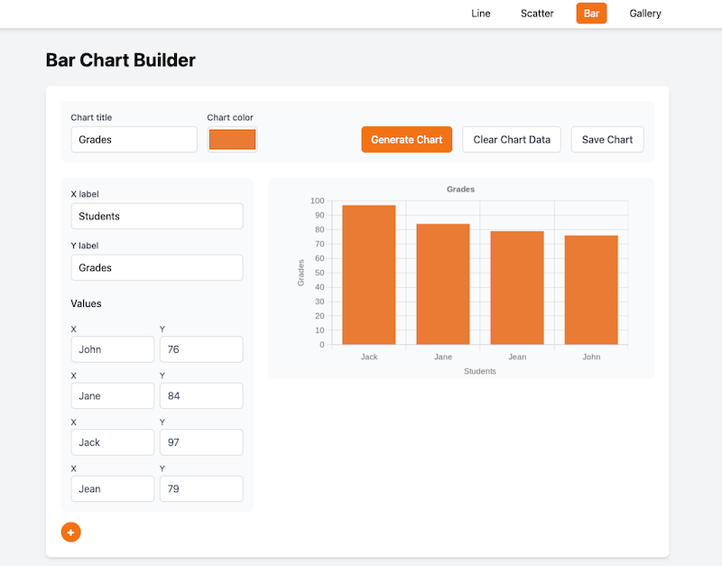

In this course, a final project will take the place of formal exams to test your understanding of the material.  For this project, you will work in teams of 3-4 to implement a complete test suite for an existing application and to develop a CI/CD pipeline for that application.  

The application you’ll be working with for the final project is a web application that allows users to build simple charts:

The app specifically allows the user to build three different kinds of charts: line charts, scatter plots, and bar charts.  The user enters chart data in a sidebar on the left-hand side of the app, sets chart options such as title and color, and then generates the chart by clicking on the “Generate Chart” button. The application also includes an option to save charts to a “Gallery”. The charts themselves are generated using a web service called the [QuickChart API](https://quickchart.io/documentation/).

Your goals for this project are to:

- Implement unit tests for relevant parts of the application.
- Implement integration tests for relevant parts of the application's UI.
- Implement end-to-end tests for important flows within the application.
- Implement a CI/CD pipeline for the application.
- Perform code review on all work for the application.

Don't forget to:

- check the **grading rubric** in the Canvas assignment, and
- check the project's README file in the template repository for more information about the application and how to run it, and
- attend your **assignment demo**, which you should have already scheduled at this point.

This is a team project. You will have a project evaluation based on the details below, as well as an individual peer-evaluation. 

## Unit Tests

Your unit tests should satisfy the following requirements:

- Unit tests should run with Vitest. 
- All unit tests should all pass.
- Unit tests should only test public functions (those being exported).
- Unit tests should adequately cover valid inputs to the functions being - tested.
- Unit tests do not need to cover error cases.
- You do not need to run the app to perform unit tests.

## Integration Tests

Many UI features are too complex for integration tests and require end-to-end tests. However, some UI features are well-suited for integration testing. Below are the features you should write integration tests for:

- **Adding values in the chart builder**: Create one or more integration tests to ensure the “add values” button (the “+” button) in the chart builder's sidebar works correctly. Each click should add a new pair of input fields for X and Y values without affecting existing data.
- **Alerts displayed for missing chart data**: Implement integration tests to verify that alerts appear correctly when a user tries to generate a chart without axis labels or data. These alerts are displayed using the `alert()` method, which you can monitor using a spy.
- **Clearing chart data**: Develop integration tests to confirm that the “Clear Chart Data” button correctly clears all user-entered chart data. This includes the chart title, color, X & Y labels, and any X or Y data points. The page should reset to display a single pair of input fields for X and Y values.
- **Data correctly sent to chart generation function**: Write integration tests to verify that user-entered chart data is correctly sent to the `generateChart()` function. You don't need to verify the chart image generation itself or mock the API. Instead, spy on `generateChart()` and stub it to return a valid image URL. Rely on your unit tests for `generateChart()` and the end-to-end tests to verify image generation.

Your integration tests should satisfy the following requirements:

- Integration tests should run with Vitest. 
- Integration tests should pass.
- Integration tests should verify the behaviors described above.  Note that these behaviors are duplicated across the three chart builder pages (bar.html, line.html, and scatter.html).  You only need to test these behaviors on one of those pages.
- Integration tests should use the Testing Library tools we explored to interact with the app the way a user would.
  - If it is simply not possible for you to use a visual characteristic to get a reference to a particular element on the page, you can assign a test ID to that element.
- This project uses the Svelte and SvelteKit frameworks. You will need to render the `.svelte` file for the chart building component into a testable DOM to perform these integration tests. You can use the `render` function from `@testing-library/svelte` to do this.
- You do not need to run the app to perform integration tests. 

## End-to-End Tests

There are key workflows within the application that necessitate end-to-end testing. Develop comprehensive end-to-end tests to validate the following functionalities:

- **Chart Generation Verification**: Create an end-to-end test to ensure that a chart image is successfully generated when a user provides the required data and clicks the "Generate Chart" button. A simple way to verify this is by confirming that an image appears on the page after clicking the button.
- **Data Persistence Across Pages**: Implement an end-to-end test to confirm that chart data is preserved when a user navigates between different chart building pages. For instance, if a user enters data in the line chart builder, this data should still be present when they switch to the scatter plot builder.
- **Saving Charts to the Gallery**: Implement an end-to-end test to verify that users can successfully save a generated chart to the application's gallery by clicking the "Save Chart" button. You can confirm this by checking if the chart's title and type are correctly displayed in the gallery.
- **Re-opening Saved Charts **: Implement an end-to-end test to ensure that when a user clicks on a saved chart in the gallery, the chart builder re-opens with the chart's data pre-populated and the generated chart image displayed.

Your end-to-end tests should satisfy the following requirements:

- End-to-end tests should run with Playwright.
- End-to-end tests should pass.
- End-to-end tests should verify the behaviors described above.
- If it is simply not possible for you to use a visual characteristic to get a reference to a particular element on the page, you can assign a [test ID to that element](https://playwright.dev/docs/locators).
- You will need to build and serve the application to be able to run tests against it with Playwright.

## CI/CD Pipeline

Implement a continuous integration and continuous deployment pipeline for your application using GitHub Actions. This pipeline should automate the following tasks:

- **Pull Request Testing**: Run all tests whenever a pull request is made into the `main` branch and when new commits are pushed to the branch associated with the pull request. Configure your project repository to prevent merging pull requests if any tests fail.
- **Main Branch Testing**: Run all tests whenever commits are pushed to the `main` branch.
- **App Building**: Build the application whenever commits are pushed to the `main` branch.
- **Deployment to GitHub Pages**: Deploy the built application (specifically, the files in the `build/` directory produced by the `npm run build` command) to GitHub Pages.

## Code Review

You must conduct code reviews for all code intended for the `main` branch of your project repository. Direct commits to the `main` branch are not allowed; instead, all code changes must be developed in separate branches. These branches can only be merged into the main branch through pull requests.

To ensure this process is followed, configure a [branch protection rule](https://docs.github.com/en/repositories/configuring-branches-and-merges-in-your-repository/managing-protected-branches/about-protected-branches) for the `main` branch of your GitHub project repository. This rule should include the following protections:

- Require pull requests before merging.
- Require status checks to pass before merging. This ensures that all tests pass on the pull request before it can be merged.
- Require conversation resolution before merging.

