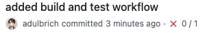
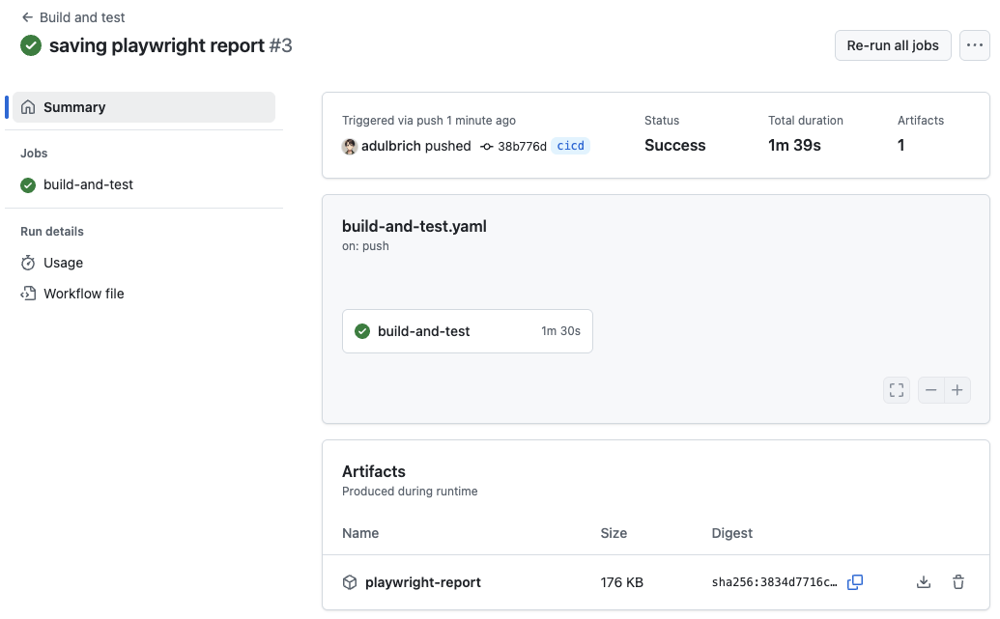

import Mermaid from "../../../components/Mermaid.astro";
import { Steps } from '@astrojs/starlight/components';

In today's software development landscape, the ability to iterate quickly is crucial. Deploying new code to production frequently offers several key advantages:

- Fixing bugs promptly as they emerge
- Delivering new features to users regularly
- Responding quickly to user feedback

However, frequent deployment requires well-established processes that both simplify deployment and ensure high-quality code. This need has driven increased focus on **continuous integration (CI)** and **continuous delivery (CD)** practices, collectively known as **CI/CD**.

## Continuous Integration

According to [Martin Fowler's widely accepted definition](https://www.martinfowler.com/articles/continuousIntegration.html),

> "Continuous Integration is a software development practice where each member of a team merges their changes into a codebase together with their colleagues changes at least daily. Each of these integrations is verified by an automated build (including test) to detect integration errors as quickly as possible. Teams find that this approach reduces the risk of delivery delays, reduces the effort of integration, and enables practices that foster a healthy codebase for rapid enhancement with new features."

Two critical aspects of this definition deserve attention:

### Frequent Integration of Changes

Under continuous integration, developers regularly incorporate their changes with the rest of the team's work. In the context of GitHub flow, this means avoiding long-lived feature branches. Instead, developers should:

- Work in small increments
- Frequently merge feature branches into the main branch (through pull requests)

**Why integrate frequently?** The longer code remains unintegrated, the more likely it diverges from the rest of the codebase, making future integration more difficult (increasing merge conflicts). Frequent integration ensures each merge represents a small, easily reconcilable step. This allows developers to focus on advancing the project rather than struggling to make their code work with the existing codebase.

### Automated Testing at Integration

The second key aspect is **building** and **testing** the codebase each time new code is integrated (typically when merging pull requests). This is what most people associate with continuous integration.

Testing code at each integration provides frequent feedback on new changes, helping maintain high code quality. Problems identified early are typically easier to fix.

Modern tooling significantly aids this process, with many platforms designed to automatically run tests at various development stages--even as frequently as every commit.

## Continuous Delivery

Continuous delivery complements continuous integration. In a robust continuous delivery practice, the software is not only built and tested with each code integration but can also be deployed at virtually any point in its lifecycle--for example, after every merge into the main branch.

The practical implementation of continuous delivery varies based on project size and complexity:

- Some projects implement full automation (**continuous deployment**), automatically building and releasing to production with each main branch merge
- Other projects may not automate the final deployment step but maintain an automated pipeline where releases can be deployed with **minimal manual intervention** ("push-button" deployment)

Like frequent integration, frequent deployment reduces the size of each release, minimizing risk and increasing deployment velocity.

Automating as much of the deployment process as possible reduces repetitive overhead and minimizes the chance of human error during deployment.

As projects grow in size and complexity, [Google's Software Engineering team recommends additional strategies](https://abseil.io/resources/swe-book/html/ch24.html):

- **Feature Flags**: Simple configuration settings that can toggle specific features on or off within the deployed application, providing granular control over feature visibility and timing.
- **Staged Rollouts**: Releasing features gradually to increasing percentages of users (e.g., canary deployments), which 
  - Makes bug resolution more manageable (affecting fewer users initially)
  - Ensures adequate infrastructure capacity for new features
- **Data-Driven Deployment**: Using metrics to guide deployment decisions, such as *A/B testing* where different user groups experience different versions of the product while performance data is collected.

Modern tooling continues to evolve to support these CI/CD practices, making them increasingly accessible to development teams of all sizes.

## Building a CI/CD Pipeline with GitHub Actions

[GitHub Actions](https://github.com/features/actions) provides a powerful way to implement CI/CD directly within your GitHub repository. While many excellent tools exist for creating CI/CD pipelines (such as [Jenkins](https://www.jenkins.io/), [Travis CI](https://www.travis-ci.com/), or [CircleCI](https://circleci.com/)), GitHub Actions offers seamless integration with your GitHub repositories.

GitHub Actions is a platform for automating workflows triggered by events in your GitHub repository. While it supports many automation scenarios--from welcoming new contributors to security scanning--we'll focus on its popular CI/CD capabilities.

### Key Components of GitHub Actions

Here are the key components of a GitHub Actions workflow:

#### Workflows

**Workflows** are automated processes [triggered by specific events](https://docs.github.com/en/actions/writing-workflows/choosing-when-your-workflow-runs/events-that-trigger-workflows) in your GitHub repository, such as:

- Code pushes to specific branches
- Pull request creation or updates
- Issue comments
- Scheduled times
- Manual triggers

#### Jobs and Steps

Each workflow consists of:

- **Jobs**: Individual units of work that run in their own virtual environment
- **Steps**: Individual tasks within a job that perform specific actions

Jobs can be configured to run:

- In parallel (simultaneously)
- Sequentially (with dependencies)

#### Runners

Every job executes in its own virtual machine called a **runner**. GitHub provides hosted runners for:

- Linux
- macOS
- Windows

You can also set up self-hosted runners for custom environments.

#### Actions

Steps within jobs can execute:

- Shell commands
- **Actions**: Reusable units that perform specific tasks

You can use actions from:

- The [GitHub Marketplace](https://github.com/marketplace?type=actions) (community-created)
- Your own custom-built actions

### Workflow Structure

A GitHub Actions workflow is defined in [YAML format](https://yaml.org/) and looks something like this:

```yaml
name: <name_of_your_workflow>

on:
  <event_1>:
    branches: <list_of_branches>
  <event_2>:
    branches: <list_of_branches>

jobs:
  <first_job_name>:
    runs-on: <runner_type>
    steps:
      - uses: <action_name>@<version>
      - name: <name_of_step>
        uses: <action_name>@<version>
        with:
          <dependency_name>: <dependency_value>
      - name: <name_of_step>
        run: <shell_command>
      - name: <name_of_step>
        run: <shell_command>
      
  <second_job_name>:
    needs: <first_job_name>
    runs-on: <runner_type>
    steps:
      - uses: <action_name>@<version>
      - name: <name_of_step>
        run: <shell_command>
```

All the text in angle brackets (`<...>`) should be replaced with your specific values.

<Mermaid showForPrint="true">
```
flowchart LR
    subgraph events
        direction TB
        event1
        event2
    end

    subgraph runner1
        direction TB
        subgraph job1
            direction TB
            R1S1[step1]
            R1S2[step2]
            R1S3[step3]
            R1S4[step4]
            R1S1 --> R1S2 --> R1S3 --> R1S4
        end
    end

    subgraph runner2
        direction TB
        subgraph job2
            direction TB
            R2S1[step1]
            R2S2[step2]
            R2S1 --> R2S2
        end
    end

    events -->|trigger| runner1 --> runner2
```
</Mermaid>

This structure demonstrates a basic CI/CD pipeline that builds and tests code on every push or pull request to the `main` branch, and deploys to production when changes are merged to `main`.

The syntax and approach for CI/CD workflows can be applied to virtually any automation task with GitHub Actions. Refer to the [GitHub Actions documentation](https://docs.github.com/en/actions) to expand on these concepts.

### Setting Up Our application

Let's go back to our [local todo application](https://github.com/adulbrich/local-todo-app). Before we can set up a CI/CD pipeline, we need to ensure our application has all the necessary scripts and configurations in place.

The repository has a `cicd` branch that has Playwright setup with a few end-to-end tests. The following npm scripts are configured:

- `npm run build` - Builds the app into a `build/` directory
- `npm run preview` - Starts a local server to preview the app
- `npm run test:e2e` - Runs headless Playwright E2E tests

Playwright is configured to run a local server with `npm run preview` and run the tests against it. The tests are located in the `e2e/` directory.

Notice that while Vitest was setup in the branch, we haven't written any unit or integration/components tests (the app is so simple that it's actually hard to do). 

Alternatively, you can start from the code written in the lectures on end-to-end testing with Playwright.

### Writing an Integration Workflow

Let's explore how to create a simple GitHub Actions workflow that automatically builds and tests your application when code is pushed to your repository.

All GitHub Actions workflows are defined in YAML files located in the `.github/workflows/` directory (note the leading dot). Let's create our first workflow file:

```yaml
// build-and-test.yaml
name: Build and test

on: [push]

jobs:
  build-and-test:
    runs-on: ubuntu-latest
    steps:
      - uses: actions/checkout@v4
      - uses: actions/setup-node@v4
        with:
          node-version: 22
      - run: npm ci
      - run: npm run build
      - run: npx playwright install --with-deps
      - run: npm run test:e2e
```

:::note[YAML Syntax]
Indentation is crucial in YAML. Ensure you use spaces (not tabs) for indentation, as YAML is sensitive to whitespace. 

Arrays can be specified using either a multi-line block style (with dashes) or an inline flow style (with square brackets, such as `[item1, item2]`). In our example, we used the block style for clarity.

Both `.yaml` and `.yml` file extensions are valid for YAML files.
:::

YAML is similar to JSON, allowing you to create structured data. Here's a breakdown of our workflow components:

- `name`: Provides a display name for the workflow in the GitHub Actions UI
- [`on`](https://docs.github.com/en/actions/writing-workflows/workflow-syntax-for-github-actions#on): Specifies which events trigger the workflow (in our case, any `push` to any branches)
- [`jobs`](https://docs.github.com/en/actions/writing-workflows/workflow-syntax-for-github-actions#jobs): Contains all the jobs this workflow will run
  - `build-and-test`: A unique identifier for our job
    - [`runs-on`](https://docs.github.com/en/actions/writing-workflows/workflow-syntax-for-github-actions#jobsjob_idruns-on): Specifies the runner environment (`ubuntu-latest`)
    - [`steps`](https://docs.github.com/en/actions/writing-workflows/workflow-syntax-for-github-actions#jobsjob_idsteps): Lists the sequential actions to perform


The `steps` section contains a series of actions to be executed in order. Each step can either use an action (with [`uses`](https://docs.github.com/en/actions/writing-workflows/workflow-syntax-for-github-actions#jobsjob_idstepsuses)) or run a shell command (with [`run`](https://docs.github.com/en/actions/writing-workflows/workflow-syntax-for-github-actions#jobsjob_idstepsrun)). The [`with`](https://docs.github.com/en/actions/writing-workflows/workflow-syntax-for-github-actions#jobsjob_idstepswith) keyword is used to pass parameters to actions.

For comparison, here's how this structure would look in JSON:

```json
{
  "name": "Build and test",
  "on": ["push"],
  "jobs": {
    "build-and-test": {
      "runs-on": "ubuntu-latest",
      "steps": [...]
    }
  }
}
```

Our workflow consists of several steps:

1. Checkout code: Uses [`actions/checkout@v4`](https://github.com/marketplace/actions/checkout) to clone your repository
2. Setup Node.js: Uses `actions/setup-node@v4` to install Node.js v22
3. Install dependencies: Runs `npm ci` ([clean install](https://docs.npmjs.com/cli/v9/commands/npm-ci), preferred for CI environments)
4. Build application: Runs `npm run build`
5. Install Playwright dependencies: Runs `npx playwright install --with-deps` to install Playwright and its dependencies
6. Run E2E tests: Runs `npm run test:e2e`

Once committed to GitHub, your workflow will run automatically on new pushes. You can monitor it through a status icon next to commit hashes:

- 🟡 Yellow dot: Currently running
- ✅ Green checkmark: Successfully completed
- ❌ Red X: Failed

Click on the status icon for details, or visit the "Actions" tab in your repository to see all workflow runs.

<div class="flex flex-col gap-2 items-center">
  
  
  
</div>

### Saving Workflow Artifacts

GitHub Actions workflows often generate important files or outputs that you may want to preserve after the workflow completes. These artifacts can include build outputs, test results, or debugging information.

For example, in our "Build and test" workflow, we might want to save the report of our end-to-end tests, particularly to help diagnose failing tests.

GitHub Actions makes this simple with the official [`upload-artifact`](https://github.com/marketplace/actions/upload-a-build-artifact) action available in the GitHub Actions Marketplace.


```yaml
// build-and-test.yaml
    steps:
      # ...previous steps (checkout, setup, build, browsers, test)
      - uses: actions/upload-artifact@v4
        if: ${{ !cancelled() }}
        with:
            name: playwright-report
            path: playwright-report/
            retention-days: 30
```

This step requires two key parameters:

- `name`: A descriptive identifier for the artifact
- `path`: The location of files to upload relative to the repository root

After pushing this updated workflow to GitHub, the Playwright report will be automatically stored when the workflow runs. To access these artifacts:

1. Navigate to the "Actions" tab in your GitHub repository
2. Select the workflow name from the sidebar
3. Choose the specific workflow run you're interested in
4. Scroll to the bottom of the workflow details page

Artifacts will be listed at the bottom of the page with download links. Click on any artifact to download it.



Beyond just storing test evidence, artifacts serve multiple purposes in your CI/CD pipelines:

- They can be downloaded and used by other jobs in the same workflow
- They can be shared between different workflows
- They provide a way to preserve important outputs for debugging or documentation

This capability becomes especially valuable in more complex workflows where outputs from one process serve as inputs to another.

### Reusable Workflows

When preparing to deploy our application using GitHub Actions, we need a well-structured approach that allows for both testing and building before deployment. Instead of duplicating steps across multiple workflows, GitHub provides a mechanism for [creating reusable workflows](https://docs.github.com/en/actions/sharing-automations/reusing-workflows).

We need to consider two important requirements:

1. **Separate testing from deployment**: We want to test all code pushes, but only deploy when changes reach the `main` branch
2. **Avoid code duplication**: Repeating the same build and test steps across different workflows increases maintenance burden

To make our "Build and test" workflow reusable, we need to modify the triggering event:

```yaml
// build-and-test.yaml
name: Build and test

on:
  workflow_call:   # This makes the workflow callable from other workflows

jobs:
  # ...existing job configuration remains unchanged
```

By changing the trigger from `push` to [`workflow_call`](https://docs.github.com/en/actions/writing-workflows/choosing-when-your-workflow-runs/events-that-trigger-workflows#workflow_call), we've transformed this workflow into a component that can be invoked from other workflows.

Since our reusable workflow no longer runs directly on code pushes, we need a new workflow to handle that event:

```yaml
// test-on-push.yaml
name: Test pushed code

on: 
  push

jobs:
  build-and-test:
    uses: ./.github/workflows/build-and-test.yaml
```

This new workflow file:

1. Runs whenever code is pushed to any branch
2. Contains a single job that calls our reusable "build and test" workflow

When these changes are committed and pushed, the testing process will continue to work exactly as before. The difference is that now our build and test process is modularized, making it available for use in our future deployment workflow without duplicating code.

:::note[On-Demand Workflows]
If you want to run a workflow on-demand (e.g., for manual testing), you can use the [`workflow_dispatch`](https://docs.github.com/en/actions/writing-workflows/choosing-when-your-workflow-runs/events-that-trigger-workflows#workflow_dispatch) event. This allows you to trigger the workflow manually from the GitHub UI.

You can also combine `workflow_dispatch` with `workflow_call` to allow both manual and automatic triggering (or any other events). For example:

```yaml
on:
  workflow_call:
  workflow_dispatch:
```

Note that `workflow_dispatch:` will only be available if the workflow is on the *default* branch, but you can run it on any branches.
:::

### Deploying Our Application

Now that our "build and test" workflow is reusable, let's create a workflow to deploy our application to GitHub Pages whenever code is pushed to the main branch.

When deploying to GitHub Pages, GitHub will deploy our application on the following URL by default: `https://<username>.github.io/<repository>/`

In many modern frameworks, internal routing happen at the root level (e.g., `/about`), which can cause issues when deployed to GitHub Pages. To address this, we need to set the `BASE_PATH` environment variable to the repository name. This will ensure that our application correctly handles routing. Our local todo application is already configured to use the `BASE_PATH` environment variable (incl. in the Playwright config).

First, we need to modify our "build and test" workflow to make the build output available for deployment. We'll add an optional input parameter that controls whether the build is stored as an artifact:

```yaml
// build-and-test.yaml
name: Build and test

on: 
  workflow_call:
    inputs:
      upload-pages-artifact:
        type: boolean
        required: false
        
jobs:
  build-and-test:
    runs-on: ubuntu-latest
    steps:
      # ...previous steps
      - run: npm run build
        env: 
          BASE_PATH: '/${{ github.event.repository.name }}'
      # ...previous steps
      - if: ${{ inputs.upload-pages-artifact }}
        uses: actions/upload-pages-artifact@v3
        with:
           path: build/
```

Our `workflow_call` now accepts an optional [`input`](https://docs.github.com/en/actions/writing-workflows/workflow-syntax-for-github-actions#onworkflow_callinputs) parameter called `upload-pages-artifact`. This parameter is a boolean that defaults to `false`. If set to `true`, the build output will be uploaded as an artifact.

Our build step now also sets the `BASE_PATH` environment variable to the repository name. This ensures that our application is built with the correct base path for routing.

:::caution[Environment Variables]
Environment variables are key-value pairs that can be used to configure the behavior of applications. In your local directory, you can create a `.env` file to define environment variables. **It is generally a good practice to add this file to your `.gitignore` file to prevent it from being committed to your repository.** Indeed, your environment variables may contain sensitive information, such as API keys or database credentials, that should not be shared publicly.

GitHub allows you to configure environment variables for your workflows. You can set them in the workflow file itself, as we did with `BASE_PATH`, or you can use GitHub Secrets to store sensitive information securely. Secrets are encrypted and can be accessed in your workflows without exposing them in the code.
:::

Our step to upload the artifact uses the [`actions/upload-pages-artifact@v3`](https://github.com/marketplace/actions/upload-github-pages-artifact) and only runs [`if`](https://docs.github.com/en/actions/writing-workflows/workflow-syntax-for-github-actions#jobsjob_idstepsif) the `upload-pages-artifact` input is set to `true`.

Now let's create a new workflow file for deployment:

```yaml
// deploy-to-gh-pages.yaml
name: Deploy to GitHub Pages

on:
  push:
    branches: [ main ]

jobs:
  build-and-test:
    uses: ./.github/workflows/build-and-test.yaml
    with:
      upload-pages-artifact: true
      
  deploy-to-pages:
    needs: build-and-test
    runs-on: ubuntu-latest
    permissions:
      pages: write
      id-token: write
    environment:
      name: github-pages
      url: ${{ steps.deployment.outputs.page_url }}
    steps:
      - uses: actions/configure-pages@v5
      - uses: actions/deploy-pages@v4
        id: deployment
```

In this workflow:

1. We call the reusable "build and test" workflow and set the `upload-pages-artifact` input to `true`. **This ensures that the build output is available for deployment.**
2. The `deploy-to-pages` job runs after the `build-and-test` job completes successfully. It uses the [`actions/configure-pages@v5`](https://github.com/marketplace/actions/configure-github-pages) action to configure the deployment settings for GitHub Pages. This action sets up the necessary environment variables and permissions for the deployment.
3. The `deploy-to-pages` job also requires the [`pages`](https://docs.github.com/en/actions/deployment/security-roles-for-deployments#github-pages) and [`id-token`](https://docs.github.com/en/actions/deployment/security-roles-for-deployments#github-pages) permissions to write to GitHub Pages.
4. Finally, the [`actions/deploy-pages@v4`](https://github.com/marketplace/actions/deploy-github-pages-site) action is used to deploy the build output to GitHub Pages. The `id` of this step is set to `deployment`, allowing us to reference the deployment URL in the environment variable.

The `environment` section specifies the environment name (`github-pages`) and the URL of the deployed site, which is obtained from the `deployment` step's output.

Before this workflow can succeed, you'll need to update your repository settings:

1. Navigate to your repository on GitHub
2. Go to **Settings** → *Pages*
3. Change the "Source" setting to "GitHub Actions"

To avoid running the build and test process twice when pushing to main, let's update our initial workflow to run only on pull requests:

```yaml
// test-on-pr.yaml
name: Test PRs

on:
  pull_request

jobs:
  build-and-test:
    uses: ./.github/workflows/build-and-test.yaml
```

With this change:

- Pull requests will be tested through this workflow
- Pushes to main will be tested and deployed through the deployment workflow
- We avoid redundant processing

As a final enhancement, you could set up a branch protection rule requiring the "Test pull requests" workflow to pass before pull requests can be merged into main.

### Improving the Workflow Speed

While running our build and test workflow, you might notice that the step to install Playwright browsers takes a while. This is because the workflow installs the browsers and dependencies every time it runs.

Playwright provides a [Docker container](https://playwright.dev/docs/ci#via-containers) that includes all the necessary browsers and dependencies. By using this container, we can significantly speed up our workflow.

In our `build-and-test.yaml` workflow, we can add our container configuration and remove our Playwright installation step:

```diff lang="yaml"
name: Build and test

on: 
  workflow_dispatch:
  workflow_call:
    inputs:
      upload-pages-artifact:
        type: boolean
        required: false
        
jobs:
  build-and-test:
    runs-on: ubuntu-latest
+    container:
+      image: mcr.microsoft.com/playwright:v1.52.0-noble
+      options: --user 1001
    steps:
      - uses: actions/checkout@v4
      - uses: actions/setup-node@v4
        with:
          node-version: 22
      - run: npm ci
      - run: npm run build
        env: 
          BASE_PATH: '/${{ github.event.repository.name }}'
-      - run: npx playwright install --with-deps
      - run: npm run test:e2e
      - if: ${{ !cancelled() }}
        uses: actions/upload-artifact@v4
        with:
            name: playwright-report
            path: playwright-report/
            retention-days: 30
      - if: ${{ inputs.upload-pages-artifact }}
        uses: actions/upload-pages-artifact@v3
        with:
           path: build/
```

The `container` section specifies the Docker image to use for the job. The `image` field points to the Playwright container, and the `options` field sets the user ID to `1001`, which runs the container as a non-root user (for security purposes).

{/* TODO */}
## Code Scanning and Security

While we already discussed best practices regarding code reviews and branch protections, and we'll discuss linting in the next section, there are additional security features available in GitHub that can help you identify and fix vulnerabilities in your code.

By embedding security checks into CI/CD, we catch issues early, reduce manual effort, and maintain trust in our applications.

### Code Scanning with CodeQL

[CodeQL](https://docs.github.com/en/code-security/code-scanning/introduction-to-code-scanning/about-code-scanning-with-codeql) is GitHub's static analysis tool for identifying security vulnerabilities and code quality issues. It treats code as data, allowing you to query it for patterns that indicate potential problems. CodeQL supports JavaScript (and TypeScript), making it perfect for analyzing Node.js applications, React frontends, or Express servers.

Manual code reviews can miss subtle vulnerabilities, like SQL injection or cross-site scripting (XSS). CodeQL automates this process, scanning code for known vulnerability patterns and integrating results into your CI/CD pipeline. This ensures that every pull request or commit is checked before deployment.

:::note[What are SQL Injections and XSS?]
**SQL Injections** is a code injection technique that allows attackers to execute arbitrary SQL queries against a database. This can lead to unauthorized access, data leakage, or even complete database compromise.

**Cross-Site Scripting (XSS)** is a vulnerability that allows attackers to inject malicious scripts into web pages viewed by other users. This can lead to session hijacking, data theft, or defacement of the website.
:::

You can enable CodeQL scanning in your repository by following these steps:

1. Go to your repository on GitHub
2. Click on the **Settings** tab
3. Click on **Advanced Security**
4. Go to the **Code Scanning** section and setup CodeQL analysis

You can select the default configuration or customize it to suit your needs. The latter will allow you to configure a workflow that runs CodeQL analysis, tailored to your specific codebase.

Here's an example. Assume we have a Node.js Express application with a vulnerable endpoint:

```js
// server.js
const express = require('express');
const app = express();

app.get('/user', (req, res) => {
  const username = req.query.name;
  // Vulnerable to XSS: Directly embedding user input in response
  res.send(`Hello, ${username}`);
});
```

Let's go ahead and add a CodeQL workflow to our repository through the "Advanced" code scanning setup. This will create a new workflow file in the `.github/workflows/` directory (default comments removed for clarity, refer to GitHub for the original file):

```yaml
// codeql.yml
name: "CodeQL Advanced"

on:
  push:
    branches: [ "main" ]
  pull_request:
    branches: [ "main" ]
  schedule:
    - cron: '32 17 * * 2'

jobs:
  analyze:
    name: Analyze (${{ matrix.language }})
    runs-on: ${{ (matrix.language == 'swift' && 'macos-latest') || 'ubuntu-latest' }}
    permissions:
      # required for all workflows
      security-events: write

      # required to fetch internal or private CodeQL packs
      packages: read

      # only required for workflows in private repositories
      actions: read
      contents: read

    strategy:
      fail-fast: false
      matrix:
        include:
        - language: actions
          build-mode: none
        - language: javascript-typescript
          build-mode: none
    steps:
    - name: Checkout repository
      uses: actions/checkout@v4
    - name: Initialize CodeQL
      uses: github/codeql-action/init@v3
      with:
        languages: ${{ matrix.language }}
        build-mode: ${{ matrix.build-mode }}
    - if: matrix.build-mode == 'manual'
      shell: bash
      run: |
        echo 'If you are using a "manual" build mode for one or more of the' \
          'languages you are analyzing, replace this with the commands to build' \
          'your code, for example:'
        echo '  make bootstrap'
        echo '  make release'
        exit 1

    - name: Perform CodeQL Analysis
      uses: github/codeql-action/analyze@v3
      with:
        category: "/language:${{matrix.language}}"
```

This workflow:

- Triggers on push or pull requests to the main branch. and on a schedule (at 17:32 UTC every Tuesday).
- Checks out the code, initializes CodeQL, and analyzes Actions and JavaScript files.
- Reports findings in the GitHub UI under the “Security” tab.
- Runs on Ubuntu by default, but uses macOS for Swift code analysis.
- Sets the specific permissions the workflow needs:
  - `security-events: write`: To write security scanning results
  - `packages: read`: To access CodeQL packages
  - `actions: read and contents: read`: For accessing repository content
- Uses a matrix strategy to scan multiple languages in parallel:
  - GitHub Actions workflows (YAML files)
  - JavaScript/TypeScript code
  - Both use "none" build mode, meaning CodeQL will automatically figure out how to analyze the code

:::note[`cron`]
The `cron` syntax is a time-based job scheduler in Unix-like operating systems. It allows you to schedule tasks to run at specific intervals. The format is:

```
* * * * *
```

Where each asterisk represents a field:
- Minute (0-59)
- Hour (0-23)
- Day of the month (1-31)
- Month (1-12)
- Day of the week (0-6, where 0 is Sunday)

In the example above (`'32 17 * * 2'`), the job runs at 17:32 UTC every Tuesday. The `*` means "every" for that field.
:::

Running this workflow will analyze your code and report any vulnerabilities or issues it finds. You can view the results in the "Security" tab of your repository. It will report something along the lines of:

> Directly writing user input (for example, an HTTP request parameter) to an HTTP response without properly sanitizing the input first, allows for a cross-site scripting vulnerability.

### Dependencies

[Dependabot](https://docs.github.com/en/code-security/supply-chain-security/understanding-your-software-supply-chain/about-supply-chain-security#what-is-dependabot) is GitHub's tool for managing dependencies by automatically updating them and flagging vulnerabilities. In JavaScript projects, where `package.json` files list dependencies like `express` or `lodash`, outdated or vulnerable dependencies are a common attack vector.

A single vulnerable dependency can compromise your application. For example, an old version of `lodash` might allow [prototype pollution attacks](https://cheatsheetseries.owasp.org/cheatsheets/Prototype_Pollution_Prevention_Cheat_Sheet.html). Dependabot scans your dependencies, checks them against vulnerability databases, and optionally creates pull requests to update them.

You can enable dependencies scanning in your repository by following these steps:

1. Go to your repository on GitHub
2. Click on the **Settings** tab
3. Click on **Advanced Security**
4. Go to the **Dependabot** section and enable Dependabot

You can configure a [custom workflow for Dependabot](https://docs.github.com/en/code-security/dependabot/dependabot-version-updates/configuring-dependabot-version-updates).

### Secrets

[Secret scanning](https://docs.github.com/en/enterprise-cloud@latest/code-security/secret-scanning/introduction/about-secret-scanning) detects sensitive information (e.g., API keys, passwords) in your code, commits, or pull requests. In JavaScript projects, secrets often appear in configuration files or environment variables, like a .env file or hardcoded API keys.

Leaking secrets can lead to unauthorized access to your systems. For example, a hardcoded AWS key in a public repository could allow attackers to spin up costly resources. GitHub's secret scanning automatically identifies and protects secrets, preventing exposure (for supported partners).

Secret scanning is enabled by default for public repositories on GitHub. For private repositories, enable it under the repository's **Settings** tab then **Advanced Security** section.

If a secret is detected, take these steps:

1. Rotate the secret: Invalidate the exposed key and generate a new one.
2. Remove the secret: Delete the hardcoded value and use environment variables.

If you need to store secrets in your repository, use [GitHub Secrets](https://docs.github.com/en/actions/security-for-github-actions/security-guides/using-secrets-in-github-actions). These are encrypted environment variables that can be accessed in your workflows without exposing them in the code.

### Container Scanning

While we haven't discussed containers in this course yet, they are a common deployment method for modern applications. Containers package applications and their dependencies into isolated environments, ensuring consistent behavior across different systems.

[Container scanning](https://www.docker.com/blog/automating-your-containers-security-scanning/) identifies vulnerabilities in container images. This is crucial for applications that rely on Docker or other container technologies, as vulnerabilities in base images can compromise the entire application.

One common tool for container scanning is [Trivy](https://trivy.dev/latest/), an open-source vulnerability scanner for containers. It scans images for known vulnerabilities and provides detailed reports.

### Dynamic Scanning

Dynamic Application Security Testing (DAST) tests your application while it's running, simulating real-world attacks to identify vulnerabilities. This is particularly useful for web applications, where user input can lead to security issues.

Dynamic scanning tools like [ZAP](https://www.zaproxy.org/) can automatically crawl your application and identify vulnerabilities like SQL injection, cross-site scripting (XSS), and insecure configurations.

These tools can be integrated into your CI/CD pipeline to ensure that security testing is part of your development process. For example, you can set up a GitHub Actions workflow that runs a dynamic scanner against your application after it has been deployed to a staging environment.

In the example below, we run our application aginast the live version of our application. This is a simple example, but you can customize it to suit your needs.

```yaml
//zap-scan.yaml
name: DAST with OWASP ZAP
on:
  push:
    branches: [main]
jobs:
  zap-scan:
    runs-on: ubuntu-latest
    steps:
      - uses: zaproxy/action-baseline@v0.14.0
        with:
          target: https://cs362.alexulbrich.com
          fail_action: true
```

## Local CI with Hooks

What if you automate tests or other tasks locally before pushing to GitHub? This can help catch issues early and ensure that your code is always in a deployable state.

[Git hooks](https://git-scm.com/book/en/v2/Customizing-Git-Git-Hooks) are scripts that run automatically at certain points in the Git workflow. They can be used to enforce coding standards, run tests, or perform other tasks before code is committed or pushed.

Hooks can run at various stages in the Git workflow, including:

- `pre-commit`: Runs before a commit is created
- `pre-push`: Runs before code is pushed to a remote repository
- `post-commit`: Runs after a commit is created
- `post-checkout`: Runs after a branch is checked out
- `post-merge`: Runs after a merge is completed

The easiest way to manage Git hooks is to use a tool like [Lefthook](https://github.com/evilmartians/lefthook) or [Husky](https://typicode.github.io/husky/). These tools allow you to define hooks in a configuration file and automatically install them in your Git repository.

Lefthook is simpler to get started. It uses a YAML configuration file to define hooks and can run tasks in parallel. 

To set up Lefthook in your project, follow these steps:

<Steps>
1. Install Lefthook as a development dependency:

      ```sh
      npm install lefthook --save-dev
      ```
2. Create a `lefthook.yml` file in the root of your project. Here's a simple example that works with our application:

    ```yaml
    pre-push:
      jobs:
        - run: npm run build
        - run: npm run test:e2e

    pre-commit:
      parallel: true
      jobs:
        - run: npm run format
        - run: npm run lint
    ```

    This configuration runs `npm run lint` and `npm run format` in parallel before each commit, and `npm run build` and `npm run test:e2e` before each push. These scripts have all been defined in our `package.json` file.

3. Initialize Lefthook in your project:

    ```sh
    npx lefthook install
    ```
</Steps>

Now everytime you commit, Lefthook will run the specified tasks. If any of the tasks fail, the commit will be aborted, allowing you to fix the issues before pushing your code. Same applies for the pre-push hook.

If you use the commit and push commands in your IDE, Lefthook will automatically run the hooks for you, but you won't see the output in the terminal. If you use the terminal, Lefthook will run the hooks and show you the output in the terminal.

### Linting and Formatting

Linting and formatting are essential practices in modern software development. They help maintain code quality, readability, and consistency across a codebase. In this section, we'll explore how to set up linting and formatting for our application using [ESLint](https://eslint.org/) and [Prettier](https://prettier.io/), respectively.

> An up and coming alternative to both ESLint and Prettier is [Biome](https://biomejs.dev/), which combines linting, formatting, and type checking into a single tool. It is designed to be fast and efficient, making it a great choice for modern JavaScript and TypeScript projects.

When working on a project, having a consistent code style is crucial for collaboration and maintainability. Linting and formatting tools help enforce coding standards and best practices, making it easier for developers to read and understand each other's code.

Linters analyze your code to detect:

- Potential bugs or errors
- Problematic patterns
- Security vulnerabilities
- Code that doesn't follow best practices
- Unused variables or imports
- Deviation from project-specific rules

Linters often provide suggestions but primarily focus on identifying issues rather than automatically fixing them, though many modern linters do offer auto-fix capabilities for certain problems.

Formatters focus exclusively on code style and make automatic changes to enforce consistent formatting:

- Indentation
- Line length
- Spacing
- Bracket placement
- Quote style
- Line endings

Formatters are opinionated and automatically rewrite your code to match a specified style, with minimal configuration options.

All languages have their own linters and formatters, but in the JavaScript ecosystem, ESLint and Prettier are the most popular choices. 

The crucial point is that you want **the whole team to agree on a single set of rules for both linting and formatting**. If you don', you might end up with many diffs in your pull requests that are just formatting changes, making it harder to review the actual code changes.

Most of the time, your linter and formatter options will be configured in your reposiory and shared among all developers. 

To enforce it consistently, you can use a **pre-commit hook** to run the linter and formatter before each commit. This ensures that all code added to our git history adheres to the same standards.

### Building and Testing

Making sure your application builds and passes all tests before pushing it to the remote (where it might go through another set of tests and be deployed) is a good practice. This can be done using Lefthook, as we saw before.

In our example, we set up a pre-push hook that runs `npm run build` and `npm run test:e2e` before each push. This ensures that the code being pushed is always in a deployable state.

It's very common to run unit tests in pre-commit hook if the test suite is fast enough. If you have a large test suite, you might want to run only a subset of tests (e.g., the ones that are affected by the changes).

As always, the tests you run (types, number, frequency) depends on many factors. You might prioritize developer experience and run your tests only in remote CI/CD (if they take too long), or you might prioritize code quality and run them locally before every commit, or you find a balance between the two.

## Additional resources

- [Continuous Integration](https://abseil.io/resources/swe-book/html/ch23.html) in Software Engineering at Google
- [Continuous Delivery](https://abseil.io/resources/swe-book/html/ch24.html) in Software Engineering at Google
- [CI/CD Explained: The DevOps Skill That Makes You 10x More Valuable](https://www.youtube.com/watch?v=AknbizcLq4w) by TechWorld with Nana
- [Devops is Terrible](https://www.youtube.com/watch?v=qVEEpUvl0Kw) by ThePrimagean, reflecting on [DevOps is Bullshit](https://www.massdriver.cloud/blogs/devops-is-bullshit).
- [Static Analysis](https://abseil.io/resources/swe-book/html/ch20.html) in Software Engineering at Google
- [Dependency Management](https://abseil.io/resources/swe-book/html/ch21.html) in Software Engineering at Google