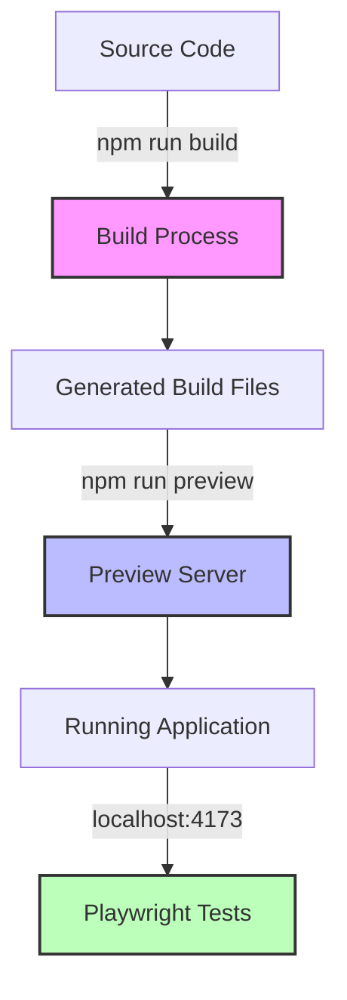
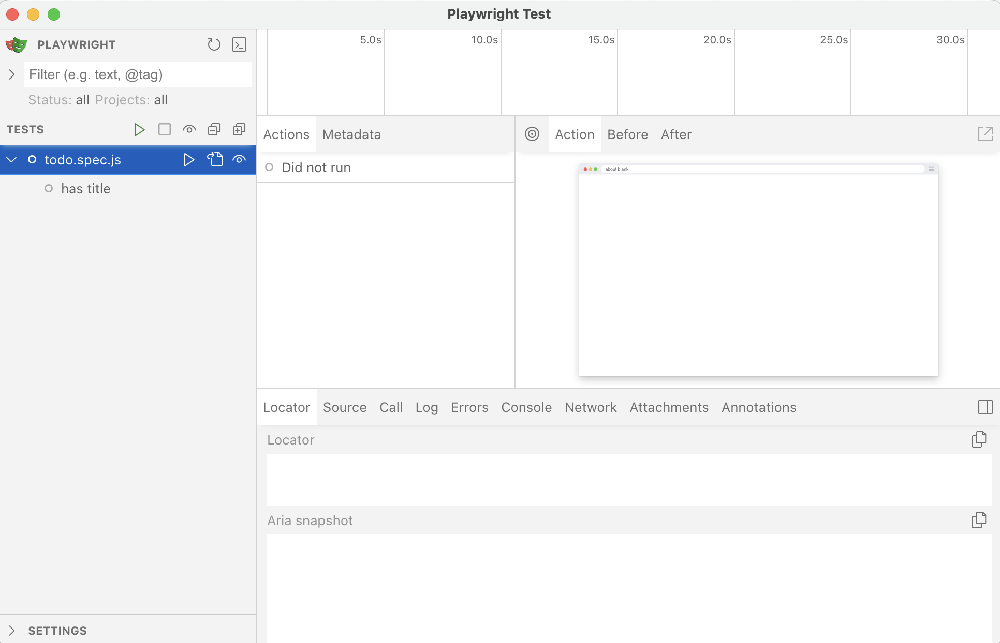
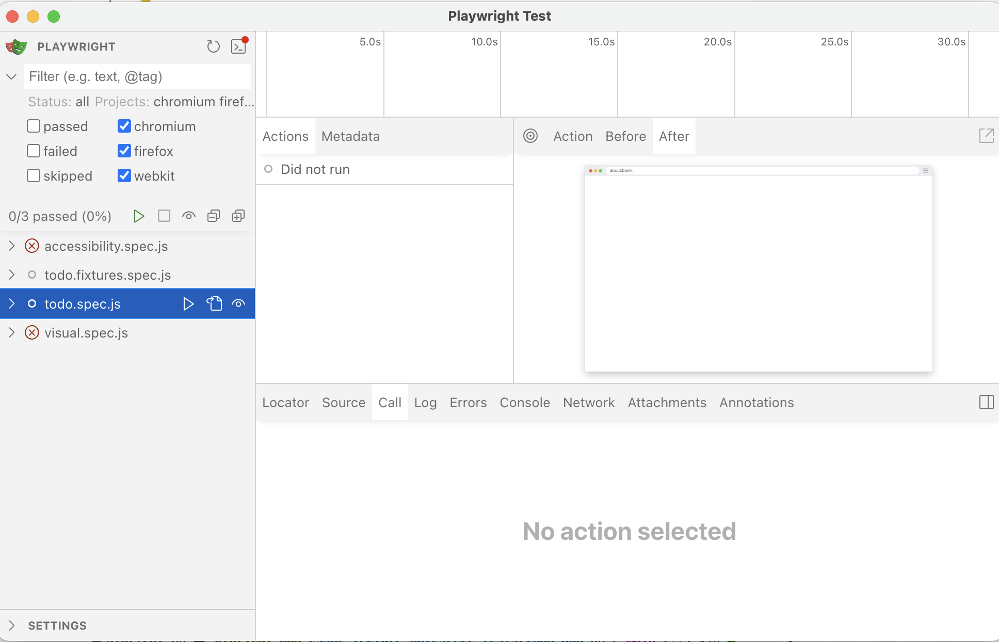

End-to-end testing is crucial for verifying that complete software systems function correctly from the user's perspective.

## What are End-to-End Tests?

While unit tests validate individual code components and integration tests verify how small groups of components work together, **end-to-end (E2E) tests** evaluate entire software systems as they would function in production environments.

E2E tests run a complete application (or a substantial portion of it) in conditions that closely resemble real-world usage, automatically interacting with the system to validate its behavior across interconnected components.

### How E2E Tests Work

For applications with graphical interfaces, E2E testing employs automated processes that mimic human interactions—clicking buttons, entering text, scrolling through pages—and verifies that each action produces the expected outcome.

A key characteristic of E2E testing is its minimal use of test doubles. Unlike smaller test types, E2E tests typically interact with all real dependencies, including those involving network communication or other resource-intensive operations that would normally be mocked in unit or integration tests.

### Cost vs. Benefit Considerations

Due to their comprehensive nature, E2E tests are:

- More expensive to develop and maintain
- Slower to execute than other test types
- Typically fewer in number within a test suite

For these reasons, E2E tests are often strategically focused on validating critical user workflows or key business processes rather than attempting to cover every possible interaction.

### E2E Testing for Web Applications

In our course, we'll explore E2E testing using [Playwright](https://playwright.dev/), a powerful tool for automating browser-based testing. Playwright will:

1. Launch real browsers (Chromium, Firefox, or WebKit-based)
2. Programmatically interact with your web application
3. Execute predefined test scenarios
4. Verify application responses using assertions
5. Provide detailed reports of test outcomes

Playwright supports not only JavaScript, but also TypeScript, Python, Java, and C#, making it a *versatile* choice for E2E testing across various programming languages. It is cross-platform (Windows, macOS, Linux) and can be used for both web and mobile applications.

This approach allows us to validate complete user journeys through our applications, ensuring they function correctly from start to finish in realistic conditions.

There are other popular E2E testing frameworks, such as [WebDriverIO](https://webdriver.io/), [Cypress](https://www.cypress.io/), and [Selenium](https://www.selenium.dev/), but Playwright stands out for its speed, reliability, and ease of use.

Playwright and WebDriverIO integrate nicely with Vitest.

## Running an Application for E2E Testing 

Before diving into how to use Playwright for end-to-end testing, it's important to understand how to properly configure your application for testing with this tool.

In this lecture, we'll work with a [simple todo application](https://github.com/adulbrich/local-todo-app) built with [Vite](https://vite.dev/) and [Svelte](https://svelte.dev/). This application is a great example of a web app that can be tested end-to-end.

### Setting Up Your Application for E2E Testing

Playwright is designed for end-to-end testing web applications and expects the application to be running on a server during tests. This matches the production environment where web applications operate through servers rather than as local files.

### Starting Your Application Server

For Playwright to interact with your web application, your application server needs to be running. That means you need to first build then preview your build. All frameworks operate a little differently, but the general idea is the same.

For example, if you're using a framework like React, Vue, Svelte, or Angular, you would typically run a build command like (refer to your framework's documentation):

```bash
npm run build
```

Then you would start a local server to serve the built files. This is often done with commands such as:

```bash
npm run preview
npm run start
```

Here's what the process looks like for a Vite project like our Todo application:



Check your `package.json` file for the exact commands to build and start your server. 

### Testing Static Web Applications

If your application consists solely of HTML, CSS, and client-side JavaScript, you can use a simple static server to serve your files. We've done that in previous lecture with the `http-server` package (but others exist, such as `serve`).

### Accessing Your Application

To test your web application, Playwright needs the URL where your application is running. Most development or preview servers will display the application URL when starting up (typically something like http://localhost:3000).

In all Playwright test scenarios, you'll need to know this URL to navigate to your application at the beginning of your tests.

### Best Practices

When setting up your testing workflow:

1. Ensure your application server starts reliably
2. Configure a consistent port for easier test automation
3. Consider using a dedicated test environment or database
4. Document the startup procedure for other team members

This server-based setup ensures that your Playwright tests interact with your application in a manner that closely resembles how real users would experience it in production.

Note that Playwright allows you to configure these steps in your test scripts, so you can automate the process of starting your server and running your tests together. This is particularly useful for continuous integration (CI) environments where you want to run tests automatically whenever code changes are made.

## Installing and Setting Up Playwright

To [install Playwright](https://playwright.dev/docs/intro), you can use the following command:

```bash
npm init playwright@latest
```

It will ask you a series of questions to set up your project. You can choose the default options or customize them according to your needs. It also creates a `playwright.config.ts` file, which contains the configuration for your Playwright tests.

If your project uses TypeScript, using Playwright with TypeScript is straightforward. The Playwright package includes TypeScript definitions, so you can write your tests in TypeScript without any additional setup.

Playwright expects your tests to be in a specific folder. By default, it will look for tests in the `tests` folder, which might be used by another testing framework. It will then propose to create a new folder called `e2e` for your Playwright tests. 

Playwright also provides a default GitHub Actions workflow file to run your tests in a CI environment. We'll discuss CI/CD and GitHub Actions in a later lecture, but for now, you can ignore this file if you're not using GitHub Actions.

Finally you have the option to install the three main browser engines that Playwright supports: Chromium, Firefox, and WebKit. These are the browser engines that Playwright will use to run your tests. You can choose to install all three or just the ones you need. 

You can [change the test configuration](https://playwright.dev/docs/test-configuration) by modifying the `playwright.config.ts` file.

:::caution[ENGR Servers]
Playwright won't work on the OSU ENGR servers because of missing dependencies and lack of permissions to install them. You could in theory install dependencies and browsers in your home directory, then run Playwright pointing to those installations, but it would be a lot of work. Instead, we recommend using Playwright on your local machine or in a cloud-based development environment.
:::

To run Playwright tests, you can use the following command:

```bash
npx playwright test
```

This command will run all the tests in the `tests` folder (or the folder you specified during setup) and generate a report of the test results.

You can use the [Playwright UI Mode](https://playwright.dev/docs/test-ui-mode) with:

```bash
npx playwright test --ui
```

The UI mode is particularly helpful as it provides a visual interface where you can:

- See all your test files
- Run tests individually or in groups
- View test results with screenshots
- Debug tests interactively with time-travel debugging

You can add one or more scripts to your `package.json` file to make it easier to run your tests. For example, you can add the following scripts:

```json
{
  "scripts": {
    "test:e2e": "playwright test",
    "test:e2e:ui": "playwright test --ui"
  }
}
```

This way, you can differentiate between different test frameworks and run them separately. 

If you want to automatically setup a development server before running your tests, you can add the [`webserver` field](https://playwright.dev/docs/test-webserver) to your `playwright.config.ts` file. This will allow Playwright to start your server before running the tests and stop it afterwards. 

```ts
// playwright.config.ts
import { defineConfig, devices } from '@playwright/test';

export default defineConfig({
  // ... other config options
  webServer: {
    command: 'npm run preview', // command you use to start your server
    url: 'http://localhost:4173/',
  },
});
```

The `preview` script above will work if our app has been built with `npm run build`.

By default Playwright favors TypeScript (`.ts`) for files. TypeScript is a superset of JavaScript that adds static typing, which can help catch errors at compile time rather than runtime. This is particularly useful for larger projects where type safety can prevent many common bugs.

## Writing Our First Playwright Test

Up to now, we've used the `.test.` file extension for our tests. Playwright uses the `.spec.` file extension in their documentation (also supported by Vitest, as you might remember). It emphasizes that tests are **specifications** of how the application should behave, not just arbitrary checks. Using `.spec.` reflects a mindset rooted in **Behavior-Driven Development (BDD)**, where tests are written to describe the behavior of the system in a human-readable, declarative way.

Let's write our first Playwright test. Create a new file called `todo.spec.js` in the `tests` folder. 

```js
// tests/todo.spec.js
import { test, expect } from '@playwright/test';

test('has title', async ({ page }) => {
	await page.goto('http://localhost:4173/');

	await expect(page).toHaveTitle(/Todo App/);
});
```

There's a lot going on in this test, so let's break it down:

- Similarly to other test frameworks such as Vitest,, the `import` statement imports the `test` and `expect` functions from the Playwright library. These functions are used to define tests and make assertions, respectively.
- The `test` function defines a test case. It takes two arguments: a **string** describing the test and an asynchronous **function** that contains the test logic.
- The function passed to `test` is *asynchronous* because the framework interacts with web browsers, which involves inherently asynchronous operations such as navigating to pages, interacting with elements, and waiting for network requests or DOM changes.
- The `page` object is a *built-in test fixture* provided by Playwright. It represents a new browser page that is created for each test. 
- The `page.goto` method navigates to the specified URL. In this case, it opens the URL of our application.
- The `expect` function is used to make assertions about the state of the application. In this case, it checks that the page title contains the substring "Todo App". This is a common way to verify that the correct page has loaded and that the application is functioning as expected.
- The `toHaveTitle` method is a Playwright-specific *assertion* that checks the title of the page. It uses a regular expression to match the title, allowing for some flexibility in the expected value.

Note how similar this is to the Vitest tests we've written before. The main difference is that Playwright provides a `page` object that allows us to interact with the browser and the application.

To run our test in UI mode, use one of the following commands:

```bash
npx playwright test --ui # to run all tests in visual mode
npm run test:e2e:ui # alternatively, if you added the script to your package.json
```

In this UI mode, the Playwright Test Runner will show you a visual representation of your tests, including their status (passed, failed, etc.), and allow you to run them interactively.



You can run the test by clocking the "Run" button next to the test name. 

## Testing our Application

Now that we have a basic test in place, let's add more tests to cover different aspects of our Todo application.

Our application allows the user to:

- create new todos, 
- mark them as completed, 
- mark them as uncompleted,
- delete them,
- archive completed todos,
- access the archive, and
- clear the archive.

These are the behaviors we want to test.

Because each test case is independent, we will need to navigate to our base address (`http://localhost:4173/`) for each test. Let's leverage a Playwright configuration option to provide a base URL for our tests.
In the `playwright.config.ts` file, add the following configuration:

```ts
// playwright.config.ts
import { defineConfig, devices } from '@playwright/test';

export default defineConfig({
  // ... other config options
  use: {
    baseURL: 'http://localhost:4173/',
  },
});
```

Now, we can modify our test to use the base URL:

```diff lang="js"
// tests/todo.spec.js
import { test, expect } from '@playwright/test';

test('has title', async ({ page }) => {
-	await page.goto('http://localhost:4173/');
+  await page.goto('/');

	await expect(page).toHaveTitle(/Todo App/);
});
```

You might remember from our UI-based integration testing lecture notes that we used Testing Library to mimic user interactions. Playwright provides a similar API, called [locators](https://playwright.dev/docs/locators) to find with elements on a page.

### Creating New Todos

Let's start by testing the creation of new todos. We can do this by filling out the input field and clicking the "Add" button.

```js
// tests/todo.spec.js
test('create new todos', async ({ page }) => {
	await page.goto('/');
	await page.getByRole('textbox').fill('Todo to complete');
	await page.getByRole('button', { name: 'Add' }).click();

	await expect(page.getByText('Todo to complete')).toBeVisible();
	await expect(page.getByRole('listitem').filter({ hasText: 'Todo to complete' })).toBeVisible();
	await expect(page.getByRole('textbox')).toHaveValue('');
});
```

In this test, we are filling the input field with the text "Todo to complete" and clicking the "Add" button. After that, we check if the new todo is visible in the list and if the input field is empty again.


:::note[Accessibility Testing]
The following assertion is considered accessibility-friendly:

```js
await expect(page.getByRole('listitem').filter({ hasText: 'Todo to complete' })).toBeVisible();
```

- It uses **ARIA roles**: The `getByRole()` locator targets elements based on their ARIA roles, which is how screen readers and other assistive technologies identify page elements. This mirrors how assistive technology users would interact with your application.
- **Semantic structure**: It validates that your todos are properly structured as list items (`<li>` elements) within a list, which follows proper HTML semantics. Screen readers announce lists and list items specifically, providing context to users.
- **Content verification**: By combining the role with [text content filtering](https://playwright.dev/docs/locators#filtering-locators), it ensures that the element is both structurally correct AND contains the expected content--both aspects are important for accessibility.

Users of assistive technologies navigate by roles and content, not by CSS classes or arbitrary attributes, so this test validates the app as experienced by these users.

By using role-based selectors, you're essentially testing your application the same way a screen reader user would experience it, which helps ensure your app remains accessible as it evolves. It tests the semantic meaning of elements rather than implementation details, making your tests robust against UI framework changes while still ensuring accessibility.
:::

We expect to also create todo by hitting the `Enter` key. This is a common pattern in many applications, and it improves the user experience by allowing users to quickly add todos without having to click the "Add" button.

```js
// tests/todo.spec.js
test('create new todo with Enter', async ({ page }) => {
	await page.goto('/');
	await page.getByRole('textbox').fill('Todo to complete');
	await page.keyboard.press('Enter');

	await expect(page.getByText('Todo to complete')).toBeVisible();
	await expect(page.getByRole('listitem').filter({ hasText: 'Todo to complete' })).toBeVisible();
	await expect(page.getByRole('textbox')).toHaveValue('');
});
```

This leverages the [`keyboard`](https://playwright.dev/docs/api/class-keyboard) API provided by Playwright to simulate pressing the `Enter` key. The rest of the test is similar to the previous one, checking if the todo was created successfully.

### Marking Todos as Completed

Next, let's test marking a todo as completed. We can do this by clicking the checkbox next to the todo item. We then verify that the checkbox is checked and that the todo item has a line-through style applied to it (which visually indicates completion in our app).

```js
// tests/todo.spec.js
test('mark todos as completed', async ({ page }) => {
	await page.goto('/');
	await page.getByRole('textbox').fill('Todo to complete');
	await page.getByRole('button', { name: 'Add' }).click();

	const todoItem = page.getByRole('listitem').filter({ hasText: 'Todo to complete' });
	await todoItem.getByRole('checkbox').click();

	await expect(todoItem.getByRole('checkbox')).toBeChecked();
	await expect(todoItem.getByText('Todo to complete')).toHaveCSS('text-decoration', /line-through/);
});
```

This test capture the `todoItem` once it has been created. Playwright allows us to **chain locators** together, so we can use the `todoItem` locator to find the checkbox and click it. After that, we check if the checkbox is checked and if the todo item has a line-through style applied to it.

The app does not implement additional accessibility best-practices for marking todos as completed. For example, it does not use the `aria-checked` attribute to indicate the state of the checkbox. This is something we should consider improving in our application.

### Dialogs

Playwright provides a way to handle dialogs, such as alerts, confirms, and prompts. You can use the [`page.on('dialog')`](https://playwright.dev/docs/dialogs) event to listen for dialog events and respond to them.

In our app, if the user tries to archive completed todos when there are none, a dialog will notify the user that there's nothing to archive. Let's test this behavior:

```js
// tests/todo.spec.js
test('nothing to archive', async ({ page }) => {
	await page.goto('/');
	await page.getByRole('textbox').fill('Todo to complete');
	await page.getByRole('button', { name: 'Add' }).click();

	let dialogMessage = '';
	page.on('dialog', async (dialog) => {
		dialogMessage = dialog.message(); // capture the dialog message
		await dialog.accept(); // accept the dialog
	});

	await page.getByRole('button', { name: 'Archive Completed Items' }).click();

	expect(dialogMessage).toContain('Nothing to archive.');
});
```

Here we listen for the `dialog` event on the `page` object. When the dialog appears, we capture its message and accept it. After that, we check if the dialog message contains the expected text.

## Test Fixtures

Playwright provides a powerful feature called **test fixtures** that allows you to set up and tear down test environments easily. Fixtures are reusable pieces of code that can be shared across multiple tests, making it easier to manage common setup and teardown tasks. We've already used the `page` fixture, which represents a new browser page for each test.

While we've used hooks such as `beforeEach` and `afterEach` in Vitest (which also work in Playwright), Playwright's [test fixtures](https://playwright.dev/docs/test-fixtures) offer a more structured way to handle setup and teardown.

Here's an example to always go to our home page and create a todo using hooks:

```js
// tests/todo.spec.js
import { test, expect } from '@playwright/test';

test.describe('todos with hooks', () => {
	test.beforeEach(async ({ page }) => {
		await page.goto('/');
		await page.getByRole('textbox').fill('Todo to complete');
		await page.getByRole('button', { name: 'Add' }).click();
	});
	test('create new todo', async ({ page }) => {
		await expect(page.getByText('Todo to complete')).toBeVisible();
		await expect(page.getByRole('listitem').filter({ hasText: 'Todo to complete' })).toBeVisible();
		await expect(page.getByRole('textbox')).toHaveValue('');
	});
});
```

We're using a `describe` block to group our tests. The `beforeEach` hook runs before each test in the group, ensuring that we start with a clean state.

Playwright's test fixtures allows us to create "named" fixtures that can be reused across different tests.

Let's create two fixtures: 

1. navigates to the home page and nothing else
2. navigates to the home page and creates a todo

```js
// tests/todo.spec.js
import { test as base, expect } from '@playwright/test';

const test = base.extend({
	todoPage: async ({ page }, use) => {
		await page.goto('/');
		await use(page);
	},
	todoPageWithItem: async ({ page }, use) => {
		await page.goto('/');
		await page.getByRole('textbox').fill('Test todo item');
		await page.getByRole('button', { name: 'Add' }).click();
		await expect(page.getByRole('listitem').filter({ hasText: 'Test todo item' })).toBeVisible();
		await use({
			page,
			todoItem: page.getByRole('listitem').filter({ hasText: 'Test todo item' })
		});
	}
});
```

There's a lot going on here, so let's break it down:

- We create a new test instance using `base.extend()`, which allows us to define custom fixtures. This means we import `test` as `base` and then create a new `test` instance with our custom fixtures.
- The `todoPage` fixture navigates to the home page and provides the `page` object to the test. This is a simple fixture that can be reused in multiple tests.
- The `todoPageWithItem` fixture does the same thing, but it also creates a todo item. It uses the `use` function to pass the `page` object and the `todoItem` locator to the test. This way we don't have to worry about the text we used to create the todo item, as it is now part of the fixture.

Our second fixture uses an assertion to make sure the todo item is visible after it has been created. This is important because it ensures that the fixture is in a valid state before the test runs. If the assertion fails, the test will not run, and we will know that there was an issue with the fixture.

Once we have our fixtures defined, we can use them in our tests by swapping our `page` argument with `todoPage` or `todoPageWithItem`. 

```js
// tests/todo.spec.js

test('create new todo', async ({ todoPage: page }) => {
	await page.getByRole('textbox').fill('Todo to complete');
	await page.getByRole('button', { name: 'Add' }).click();

	await expect(page.getByText('Todo to complete')).toBeVisible();
	await expect(page.getByRole('listitem').filter({ hasText: 'Todo to complete' })).toBeVisible();
	await expect(page.getByRole('textbox')).toHaveValue('');
});

test('mark todos as completed', async ({ todoPageWithItem: { page, todoItem } }) => {
	await todoItem.getByRole('checkbox').click();
	await expect(todoItem.getByRole('checkbox')).toBeChecked();
	await expect(todoItem.getByText('Test todo item')).toHaveCSS('text-decoration', /line-through/);
});
```

With this, we can easily reuse our fixtures across different tests. The `todoPage` fixture is used to create a new todo, while the `todoPageWithItem` fixture is used to mark an existing todo as completed. This is more explicit and flexible than using hooks.

## Testing For Accessibility

Playwright provides built-in support for [accessibility testing](https://playwright.dev/docs/accessibility-testing), allowing you to check if your web application meets accessibility standards. This is crucial for ensuring that your application is usable by people with disabilities.

The Playwright accessibility testing feature is based on the [axe-core](https://github.com/dequelabs/axe-core) library, which is a popular accessibility testing engine. It can automatically detect a wide range of accessibility issues in your web application.

Install the `@axe-core/playwright`:

```sh
npm install --save-dev @axe-core/playwright
```

Then we can write a test to check for accessibility issues on our website our application. 

```js
// tests/accessibility.spec.js
import { test, expect } from '@playwright/test';
import AxeBuilder from '@axe-core/playwright';

test.describe('cs362 homepage', () => { 
  test('should not have any automatically detectable accessibility issues', async ({ page }) => {
    await page.goto('https://cs362.alexulbrich.com/');

    const accessibilityScanResults = await new AxeBuilder({ page }).analyze(); // 4

    expect(accessibilityScanResults.violations).toEqual([]);
  });
});
```

You can configure your tests to only scan part of the page or to scan for specific issues. You can also exclude certain elements from the scan (i.e., elements that are not relevant to accessibility or know issues).

:::note[WAI-ARIA]
The [Web Accessibility Initiative - Accessible Rich Internet Applications (WAI-ARIA)](https://www.w3.org/WAI/standards-guidelines/aria/) is a set of attributes that can be added to HTML elements to improve accessibility for people with disabilities. It provides additional semantic information about the elements on the page, which can be used by assistive technologies such as screen readers.
:::

### Accessibility Snapshots

In addition to visual comparisons (see below), Playwright also provides a way to take [accessibility snapshots](https://playwright.dev/docs/accessibility-testing) of your web application. This is useful for checking the accessibility tree and ensuring that your application is accessible to users with disabilities.

You can take an accessibility snapshot of a specific element or the entire page. This snapshot contains information about the accessibility tree, including the roles, states, and properties of each element.

Let's take a new snapshot of our todo list with one item:

```js
// tests/todo.spec.js
test('create new todo', async ({ page }) => {
	await page.goto('/');
	await page.getByRole('textbox').fill('Todo to complete');
	await page.getByRole('button', { name: 'Add' }).click();

	await expect(page.getByText('Todo to complete')).toBeVisible();
	await expect(page.getByRole('listitem').filter({ hasText: 'Todo to complete' })).toBeVisible();
	await expect(page.getByRole('textbox')).toHaveValue('');

	await expect(page.locator('body')).toMatchAriaSnapshot('');
});
```

Calling `toMatchAriaSnapshot()` will take a snapshot of the accessibility tree and compare it to a previously saved snapshot. If we call it with an empty string, it will generate a new snapshot for us. We can then add it to our test:

```js
// tests/todo.spec.js
test('create new todo', async ({ page }) => {
	await page.goto('/');
	await page.getByRole('textbox').fill('Todo to complete');
	await page.getByRole('button', { name: 'Add' }).click();

	await expect(page.getByText('Todo to complete')).toBeVisible();
	await expect(page.getByRole('listitem').filter({ hasText: 'Todo to complete' })).toBeVisible();
	await expect(page.getByRole('textbox')).toHaveValue('');

	await expect(page.locator('body')).toMatchAriaSnapshot(`
        - heading \"Todo List\"
        - textbox \"Add a new todo\"
        - button \"Add\":
            - img
            - text: Add
        - list:
            - listitem:
                - checkbox
                - text: Todo to complete
                - button \"Delete\"
        - button \"Archive Completed Items\":
          - img
          - text: Archive Completed Items
        - button \"View Archive\":
          - img
          - text: View Archive
    `);
});
```

Remember that the "rules" for using snapshots are very similar to those mentioned for Vitest snapshots:

- Testing whole complex pages
- Broad structural checks
- Regression testing for things that rarely change

## Visual Comparisons

In addition to accessibility snapshots, Playwright also provides a way to take [visual snapshots](https://playwright.dev/docs/test-snapshots) of your web application.

Let's test our handbook homepage:

```js
// tests/visual.spec.js
import { test, expect } from '@playwright/test';

test('cs362', async ({ page }) => {
	await page.goto('https://cs362.alexulbrich.com');
	await expect(page).toHaveScreenshot();
});
```

As usual, the first time it runs, it will create a new snapshot (our baseline). The next time it runs, it will compare the current screenshot with the previously saved one. If they are different, the test will fail.

A new directory and file will be created in your `/tests` directory. You'll notice that the file name has the name of the test and the browser engine and platform used to run the test. For example, if you run the test on Chromium on macOS, the file name will be `cs362-1-chromium-darwin.png`.

Browser rendering can vary based on different factors. It is recommended to run these snapshot tests in the same environment where the baseline was generated.

## Testing in Different Browsers, Devices, and Environments

So far, our tests have run on the default browser engine (Chromium).

A good end-to-end test suite should cover multiple browsers and devices to ensure that your application works correctly across different platforms. Playwright makes it easy to run tests on [different browsers and devices](https://playwright.dev/docs/browsers). Playwright calls them "projects".

In addition to Chromium, the Firefox and WebKit browser engines were probably already installed when you installed Playwright. 

To configure these other browsers, you can modify the `playwright.config.ts` file to include them as projects. Here's an example:

```ts
// playwright.config.ts
export default defineConfig({
	projects: [
		{
		  name: 'chromium',
		  use: { ...devices['Desktop Chrome'] },
		},
		{
		  name: 'firefox',
		  use: { ...devices['Desktop Firefox'] },
		},
		{
		  name: 'webkit',
		  use: { ...devices['Desktop Safari'] },
		},
	],
  // ... other config options
});
```

In UI Mode, you can toggle different browsers on or off using the menu in the top left corner.



If you run the tests *not* in UI mode, they will automatically run in all the projects you configured. 

You can also run a specific project by using the `--project` flag:

```bash
npx playwright test --project=firefox
```

An important consideration in the modern web is to test your application on mobile devices. While Playwright provides a huge lists of supported devices, let's start simple:

```ts
// playwright.config.ts
export default defineConfig({
  projects: [
    // ... other projects
    {
      name: 'Mobile Chrome',
      use: { ...devices['Pixel 5'] },
    },
    {
      name: 'Mobile Safari',
      use: { ...devices['iPhone 12'] },
    },
  ],
  // ... other config options
});
```

You can install new browsers using:

```sh
npx playwright install
```

We can also split tests into groups. These groups can be [different environments](https://playwright.dev/docs/test-projects#configure-projects-for-multiple-environments) with different base URLs and configuration options, or [different test subsets](https://playwright.dev/docs/test-projects#splitting-tests-into-projects).

You can configure different environments in the `playwright.config.ts` file by naming your projects and providing different configuration options including base URLs, timeouts, and retries. This is useful for testing your application in different environments, such as staging and production. 

```ts
// playwright.config.ts
  projects: [
    {
      name: 'staging',
      use: {
        baseURL: 'staging.example.com',
      },
    },
    {
      name: 'production',
      use: {
        baseURL: 'production.example.com',
      },
    },
  ],
```

You can also configure different test subsets by using the `testMatch` option. This allows you to run only a specific set of tests based on their file names or tags. For example, you can run only the tests that match a specific pattern:

```ts
// playwright.config.ts
  projects: [
    {
      name: 'Smoke',
      testMatch: /.*smoke.spec.ts/,
    },
    {
      name: 'Default',
      testIgnore: /.*smoke.spec.ts/,
    },
  ],
```

:::note[Smoke Tests]
Smoke tests are a subset of tests that cover the most critical functionality of an application. They are designed to quickly verify that the application is working as expected after a new build or deployment. Smoke tests are typically run before more extensive testing, such as regression testing, to ensure that the application is stable enough for further testing.
:::

## Additional Playwright Features

- [Emulation](https://playwright.dev/docs/emulation) allows you to simulate different devices, network conditions, geolocation settings, and many other environmental factors. This is useful for testing how your application behaves under different conditions.
- [Clock](https://playwright.dev/docs/clock) allows you to control the passage of time in your tests (i.e., stubbing). This is useful for testing time-dependent features, such as animations, timeouts, and scheduled tasks.
- You can record [videos](https://playwright.dev/docs/videos) of your tests, which can be helpful for debugging and understanding test failures. Playwright can record videos of the entire test run or just specific parts of it.
- You can enable [retries](https://playwright.dev/docs/test-retries) for your tests. This is useful for flaky tests that may fail intermittently due to network issues or other factors. Playwright will automatically retry failed tests a specified number of times before marking them as failed.
- Playwright's [Mock APIs](https://playwright.dev/docs/mock) allow you to intercept and modify network requests and responses.
- Finally, we can setup [Continuous Integration](https://playwright.dev/docs/ci-intro) to run our tests automatically whenever we push changes to our repository. This is useful for continuous integration and deployment (CI/CD) workflows. This will be covered in a later lecture.

## Additional Resources

- [Best Practices](https://playwright.dev/docs/best-practices)
- [Larger Testing](https://abseil.io/resources/swe-book/html/ch14.html) in Software Engineering at Google
- Combine [Appium](https://appium.io/) with [WebdriverIO](https://webdriver.io/) for *native* mobile testing

{/* ## Mocking and Faking */}

{/* https://playwright.dev/docs/clock */}
{/* https://playwright.dev/docs/mock */}

{/* Multiple web servers */}
{/* https://playwright.dev/docs/test-webserver#multiple-web-servers */}