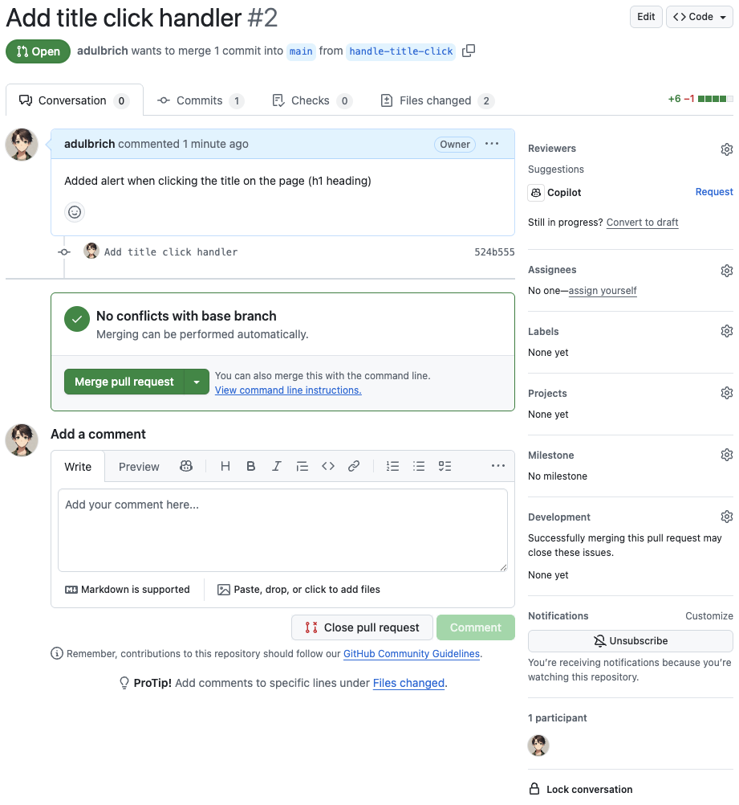
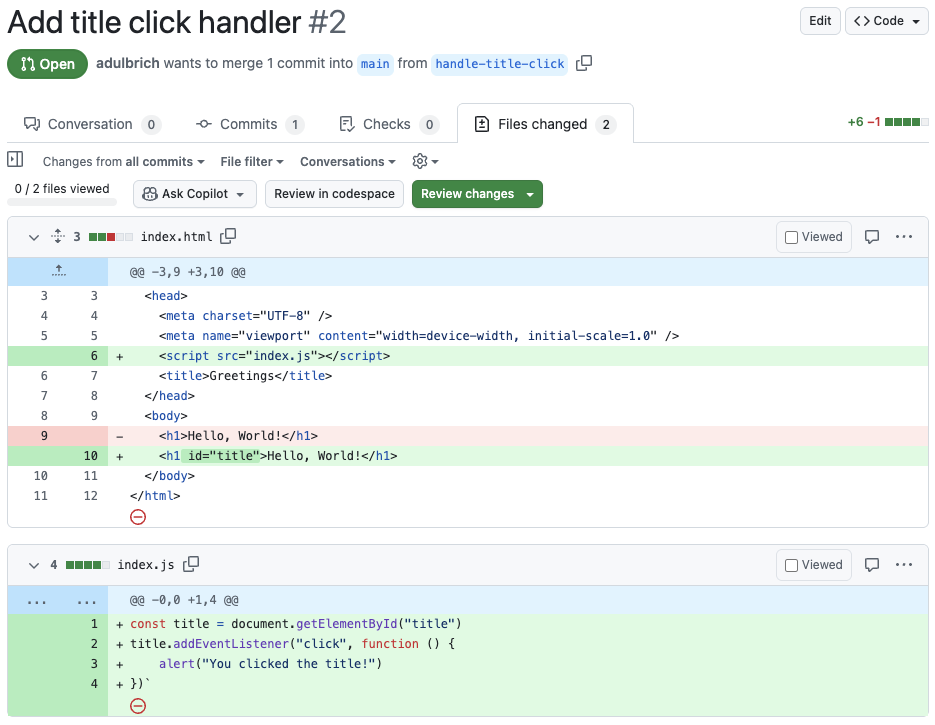
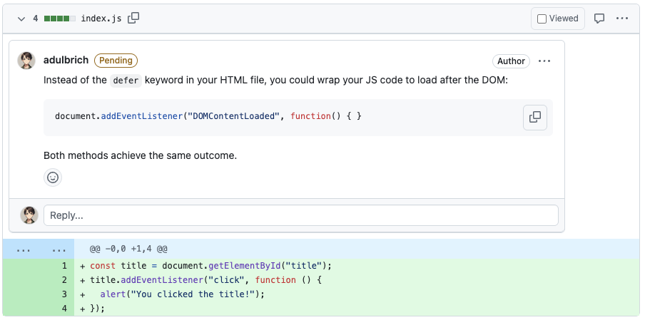

import Mermaid from "../../../components/Mermaid.astro";
import { Steps } from '@astrojs/starlight/components';

We've already explored how to use Git and GitHub from an individual perspective, covering the most common workflows for personal projects. However, the true power of Git and GitHub emerges when teams collaborate on shared code.

## The Challenge of Team Collaboration

While Git and GitHub facilitate teamwork, successful collaboration requires careful coordination. Each developer must:

- Stay aware of changes made by teammates
- Ensure their contributions integrate smoothly with the existing codebase
- Avoid accidentally overwriting or conflicting with others' work

Without proper coordination, developers can unintentionally break the shared codebase by introducing incompatible changes or undoing another's work.

Teams typically adopt specific workflows to help members collaborate effectively. An ideal team workflow should:

- Keep everyone informed about ongoing development efforts
- Verify that new code integrates properly with the existing codebase
- Provide clear processes for contribution and review

One of the most popular team-based approaches is the [GitHub flow](https://docs.github.com/en/get-started/using-github/github-flow) (also called the [feature branch workflow](https://www.atlassian.com/git/tutorials/comparing-workflows/feature-branch-workflow)). This straightforward workflow has gained popularity due to its simplicity and effectiveness.

:::note[Git Flow?]
[GitFlow](https://nvie.com/posts/a-successful-git-branching-model/) is a branching model for Git created by [Vincent Driessen](https://nvie.com/about/) in 2010 that defines a strict branching structure designed around project releases.

It has two main branches:

- `main` (or master): contains production-ready code
- `develop`: integration branch for features

And a few supporting branches:

- `feature-*`: for new features (branched from `develop`)
- `release-*`: for preparing releases (branched from `develop`)
- `hotfix-*`: for urgent production fixes (branched from `main`)

GitFlow has fallen out of favor primarily due to its complexity and poor alignment with modern development practices. The multiple long-lived branches create overhead that slows down development cycles, while the structured release process doesn't mesh well with continuous deployment approaches. Many teams now prefer simpler alternatives like GitHub Flow that support faster iteration cycles and more frequent releases.

Development practices have shifted toward continuous integration and deployment, making GitFlow's elaborate branching strategy feel unnecessarily cumbersome for most web and cloud applications. While it remains useful for teams managing versioned software releases, its rigid structure has proven too heavyweight for the rapid pace of modern software development.
:::

## The GitHub Flow

The GitHub flow is a streamlined workflow designed for team collaboration using Git **branches** and GitHub **pull requests**. This approach effectively:

- Isolates each developer's work to prevent code conflicts
- Creates visibility across the team about ongoing development
- Establishes a code review process that ensures quality before code reaches production

Here's an overview of the workflow. We'll dig in deeper into each step in the following sections.

1. The `main` branch represents production code
    - code in the `main` branch should always be deployable
    - all changes to the `main` branch should be made through pull requests
    - the `main` branch should be protected to prevent direct pushes
2. Developers create a new branch for each task
    - branch off from `main` to work on features, fixes, or improvements
    - branch names should be descriptive and follow a consistent naming convention
3. Developers make changes in their branches
    - work on the task in isolation, committing changes to the branch
    - keep commits small and focused on a single change or feature
    - write clear commit messages that explain the purpose of each change
    - use `git pull` to keep the branch up to date with `main`
    - push changes to the remote branch on GitHub
4. Open a pull request when ready for review or production
    - when the branch is ready for review, open a pull request on GitHub
    - provide a clear description of the changes and their purpose
    - tag relevant team members for review
5. Review and discuss
    - team members provide feedback in the pull request
    - you respond to feedback by making changes or explaining your decisions
6. Test thoroughly
    - all changes should pass automated tests
    - when possible, team members should manually test the changes
7. Merge after approval
    - after sufficient review and approval from teammates, merge your branch into `main`
    - resolve any merge conflicts that arise
    - ensure the code is up to date with `main` before merging
    - squash commits if necessary to keep the commit history clean
8. Deploy changes
    - once merged, deploy the changes to production
    - ensure the deployment process is automated and reliable
    - monitor the deployment for any issues or bugs

{/* TODO: change diagram by a normal TD one to illustrate steps above */}

<Mermaid showForPrint="true">
```
flowchart TD
    B[main branch] --> C[Create feature branch]
    C --> D[Make changes in feature branch]
    D -->|"When ready"| E[Open/Update Pull Request]
    E --> F[Review and discuss]
    F -->|"Changes needed"| D
    F -->|"Approved"| G[Test thoroughly]
    G -->|"Tests fail"| D
    G -->|"Tests pass"| H[Merge to main]
    H --> I[Deploy changes]
    B -.pull from main.-> D
```
</Mermaid>

## Understanding Git Branches

Git's core purpose is to store a series of snapshots (commits) of your project over time, creating a **commit history**. Without branching, this history is linear—just one commit after another in the main branch:

<Mermaid showForPrint="true">
```
gitGraph
  commit id: "1"
  commit id: "2"
  commit id: "3"
  commit id: "4"
  commit id: "5"
```
</Mermaid>

Branches allow the commit history to diverge into parallel paths, each with its own unique commits:

<Mermaid showForPrint="true">
```
gitGraph
  commit
  commit
  branch feature1
  checkout feature1
  commit
  commit
  checkout main
  commit
  branch feature2
  checkout feature2
  commit
  checkout feature1
  commit
  commit
  checkout feature2
  commit
  commit
  checkout main 
  commit
```
</Mermaid>

Key Branch Concepts:

- Each new branch must start from an existing commit
- Up to the starting commit, branches share history
- After the starting point, branch histories diverge

For example, in the diagram above, the `feature1` branch was created from the `main` branch at commit `1-*`. Both branches share commits `0-*` and `1-*` but their histories differ after that point.

Branches create isolated environments where developers can work without affecting others. This isolation:

- Prevents code conflicts between team members
- Allows experimentation without risking the main codebase
- Enables multiple features to be developed simultaneously
- Facilitates organized code reviews before integration

This branch-based workflow ensures that changes are properly validated before they affect the production environment.

Read [git branches: intuition & reality](https://jvns.ca/blog/2023/11/23/branches-intuition-reality/) by Julia Evans for a deeper understanding of how branches work in Git.

### Working with Branches

Let's explore how to work with branches in a practical scenario.

Imagine we're working in a repository with a single main branch containing a few commits:

```sh
git log --oneline
```

```plaintext
ed1523e (HEAD -> main) Add document title
39cfcb0 Add Hello, World header
5c19c53 Create index.html
```

We can list all branches with:

```sh
git branch
```

```plaintext
* main
```

#### Task: Adding CSS

We've been assigned to add CSS to the application. Following good practices, we'll create a new branch for this work:

```sh
git branch add-css
```

Checking our branches shows:


```sh
git branch
```

```plaintext
  add-css
* main
```

The asterisk (`*`) indicates that `main` is still our active branch. To work in our new branch, we need to switch to it:

```sh
git checkout add-css
```

:::tip[Git Checkout]
You can create and switch to a new branch in one command with:

```sh
git checkout -b add-css
```
:::

At this point, both branches point to the same commit.

Let's modify the HTML to link a stylesheet and create the empty CSS file:

```diff lang="html"
// index.html
<!DOCTYPE html>
<html lang="en">
  <head>
    <meta charset="UTF-8" />
    <meta name="viewport" content="width=device-width, initial-scale=1.0" />
+    <link rel="stylesheet" href="style.css">
    <title>Greetings</title>
  </head>
  <body>
    <h1>Hello, World!</h1>
  </body>
</html>
```

After creating these files, let's commit our changes:

```sh
git add style.css index.html
git commit -m "Create style.css and link it to HTML"
```

Looking at our commit history now shows the branch divergence:

```sh
git log --oneline
```

```plaintext
22854e0 (HEAD -> add-css) Create style.css and link it to HTML
ed1523e (origin/main, main) Add document title
39cfcb0 Add Hello, World header
5c19c53 Create index.html
```

Visually, our repository now looks like:

<Mermaid showForPrint="true">
```
gitGraph
  commit id: "1"
  commit id: "2"
  commit id: "3"
  branch add-css
  checkout add-css
  commit id: "4"
```
</Mermaid>

The `origin/main` in our log indicates we have a remote repository. We can verify this:

```sh
git remote -v
```

```plaintext
origin  https://github.com/<username>/<repo>.git (fetch)
origin  https://github.com/<username>/<repo>.git (push)
```

Let's push our new branch to GitHub:

```sh
git push --set-upstream origin add-css
```

Now our branch is visible in the GitHub interface in the branches dropdown.


Let's add some CSS to our stylesheet:

```css
// style.css
html {
    font-family: sans-serif;
}

h1 {
    font-variant: small-caps;
}
```

Then commit and push:

```sh
git add style.css
git commit -m "Do some work on font styling"
git push
```

#### Task: Adding Interactivity with JavaScript

Meanwhile, another developer has been tasked with adding JavaScript functionality, starting from the same `main` branch:

```sh
git checkout main
git checkout -b handle-title-click
```

This developer creates `index.js`:

```js
// index.js
const title = document.getElementById("title")
title.addEventListener("click", function () {
    alert("You clicked the title!")
})`
```

And modifies `index.html`:

```diff lang="html"
// index.html
<!DOCTYPE html>
<html lang="en">
  <head>
    <meta charset="UTF-8" />
    <meta name="viewport" content="width=device-width, initial-scale=1.0" />
+    <script src="index.js"></script>
    <title>Greetings</title>
  </head>
  <body>
+    <h1 id="title">Hello, World!</h1>
-    <h1>Hello, World!</h1>
  </body>
</html>
```

They commit and push their changes:

```sh
git add index.html index.js
git commit -m "Add title click handler"
git push --set-upstream origin handle-title-click
```

Visually, our repository now looks like:

<Mermaid showForPrint="true">
```
gitGraph
  commit id: "1"
  commit id: "2"
  commit id: "3"
  branch add-css
  checkout add-css
  commit id: "4"
  commit id: "5"
  checkout main
  branch handle-title-click
  checkout handle-title-click
  commit id: "6"
```
</Mermaid>

Both features are now complete and ready to be considered for merging into the main branch. According to GitHub Flow, the next step is to create **pull requests** for each branch.

Before we explore pull requests, let's understand what **merging** means in Git.

### Merging Branches

A pull request is fundamentally a request to merge one branch (containing your changes) into another branch. Most commonly, pull requests merge feature branches into the `main` branch.

In Git, **merging** refers to the `git merge` operation, which combines multiple commit sequences into a unified commit history. When you merge branches:

- Changes from the target branch are combined into your current branch
- The branch you're merging into must be your active branch (the one marked with an asterisk `*` in `git branch`)

Unless conditions allow for a *fast-forward merge*, Git creates a special merge commit when combining branches. This merge commit represents the integration of changes from the target branch into your current branch.

For example, imagine we have a new `feature` branch that we want to merge into the `main` branch of our repo:

<Mermaid showForPrint="true">
```
gitGraph
  commit id: "1"
  commit id: "2"
  commit id: "3"
  branch feature
  checkout feature
  commit id: "4"
  checkout main
  commit id: "5"
  checkout feature
  commit id: "6"
  checkout main
  commit id: "7"
```
</Mermaid>

After merging the `feature` branch into `main`, a new merge commit will be added to main that incorporates the changes from the feature branch:

<Mermaid showForPrint="true">
```
gitGraph
  commit id: "1"
  commit id: "2"
  commit id: "3"
  branch feature
  checkout feature
  commit id: "4"
  checkout main
  commit id: "5"
  checkout feature
  commit id: "6"
  checkout main
  commit id: "7"
  merge feature id: "Merge Commit"
```
</Mermaid>

This process ensures the `main` branch now contains all code implemented in the feature branch.

#### Fast-Forward Merges

A **fast-forward merge** is a special merge that doesn't create a merge commit. This type of merge is only possible under specific circumstances:

- There must be a direct linear path between the current branch and target branch
- The current branch's tip must be a direct ancestor of the target branch's tip

Visually, this looks like:

<Mermaid showForPrint="true">
```
gitGraph
  commit id: "1"
  commit id: "2"
  commit id: "3"
  branch feature
  checkout feature
  commit id: "4"
  commit id: "5"
  commit id: "6"
```
</Mermaid>

In this scenario, Git can simply "fast forward" the current branch pointer to the position of the target branch:

<Mermaid showForPrint="true">
```
gitGraph
  commit id: "1"
  commit id: "2"
  commit id: "3"
  branch feature
  checkout feature
  commit id: "4"
  commit id: "5"
  commit id: "6"
  checkout main
  merge feature id: "Fast-Forward Merge"
```
</Mermaid>

If the branches have diverged in any way (both have unique commits), Git cannot perform a fast-forward merge and will instead create a merge commit using a **three-way merge** process, as discussed above.

## GitHub Pull Requests

GitHub **pull requests** provide a structured mechanism for incorporating proposed changes into the codebase. They serve multiple purposes:

- Notify team members about proposed changes
- Create a dedicated space to review and discuss modifications
- Allow collaborators to provide feedback and request adjustments
- Facilitate formal approval (or rejection) of changes before merging

At its core, a pull request is a request to merge one branch into another--typically merging a feature branch into the `main` branch. Both branches must exist on GitHub for a pull request to be created.

Since we've pushed our `add-css` branch to GitHub and want to merge it into `main` (which is also on GitHub), we have everything needed to create a pull request.

When you push a branch to GitHub, the platform often displays a helpful banner with a prompt:


Alternatively, you can navigate to the **Pull Requests** tab in your repository and click the **New pull request** button:


In the comparison page:

1. Select your branch (e.g., `add-css`) in the "compare" dropdown
2. Keep main as the "base" branch
3. Review the displayed commits and code differences
4. Click "Create pull request"


After clicking "Create pull request," you'll need to provide:

- Title: A concise description of the changes
- Description: A more detailed explanation of what the changes accomplish

Then click "Create pull request" again. Note that you should only select ["Create draft pull request"](https://docs.github.com/en/pull-requests/collaborating-with-pull-requests/proposing-changes-to-your-work-with-pull-requests/about-pull-requests#draft-pull-requests) for branches not yet ready for review or merging.


After creation, you'll be taken to the pull request's "Conversation" tab, which provides:

- A summary of the pull request
- A list of commits included
- A discussion area for general feedback

The "Files changed" is another important tab that shows a line-by-line diff of all code modifications, where reviewers can add specific comments and conduct a thorough code review.

This structured process ensures code changes are properly reviewed before being incorporated into the main codebase.

### Code Reviews

**Code review** is a critical part of the development process that improves code quality and distributes knowledge across the team. Since pull requests are the final check before code reaches production, thorough reviews are essential. Let's explore GitHub's tools for effective code reviews.

Imagine another developer has created a pull request for their `handle-title-click` branch. Let's walk through reviewing their changes.

#### Conversation Tab

The "Conversation" tab serves as a general discussion forum for the pull request. You can use this space for:

- Broad comments about the approach
- Questions about implementation decisions
- High-level feedback

 
{/* TODO: update this oneto the JS one */}

While you can provide general feedback here, detailed code review is better conducted in the "Files changed" tab.

#### Files Changed Tab

The "Files changed" tab is specifically designed for thorough code reviews. It displays a line-by-line diff of all changes and offers specialized review tools:



If you identify a potential bug or have a suggestion about specific code:

1. Hover over the relevant line
2. Click the blue "+" button that appears (or drag to select multiple lines)
3. Type your comment
4. Choose either:
    - Add single comment: For standalone feedback
    - Start a review: To begin a formal review requiring resolution


When you start a review, your comment is marked as "pending" until you submit the complete review:


{/* TODO: missing id="title" on <h1> tag */}

After reviewing a file, you can mark it as "viewed" to:

- Collapse its diff
- Track your progress through the review
- Help focus on remaining files


Continue adding comments to any files that need attention, for example:



After reviewing all files, submit your complete review by:

1. Clicking "Review changes"
2. Adding a summary comment
3. Selecting one of three options:
    - **Comment**: General feedback with no explicit approval
    - **Approve**: Changes look good and can be merged
    - **Request changes**: Issues must be addressed before merging

In our case, the current implementation does not work, so we need to request changes.

The pull request author should then:

- Make commits addressing your requested changes, or
- Explain why they believe the changes aren't necessary

Once satisfied with their response, you can either approve the changes or dismiss your review.

After the required number of approvals (determined by your team), you can merge the pull request by clicking "Merge pull request" on the conversation tab.

Once merged, all team members should:

1. **Pull the updated `main` branch to their local repositories**
2. Delete the feature branch both on GitHub and locally to reduce clutter

This structured review process ensures code quality while maintaining clear documentation of decisions made during development.

### Resolving Merge Conflicts

When checking our pull request after another developer's changes have been merged into the `main` branch, we may encounter a situation where our PR can no longer be automatically merged due to conflicts:


We must resolve these conflicts by adding at least one commit before our pull request can be merged.

While GitHub offers a "Resolve conflicts" button with a web-based editor, it's generally better practice to resolve conflicts locally in our development environment.

To address these conflicts, follow these steps:

<Steps>
1. Pull the latest changes to `main` locally:

    ```sh
    git checkout main
    git pull
    ```

2. Ensure you're on your feature branch:

    ```sh
    git checkout add-css
    ```

3. Merge the updated `main` branch into your feature branch:

    ```sh
    git merge main
    ```

    Git will report the conflicts:

    ```plaintext
    Auto-merging index.html
    CONFLICT (content): Merge conflict in index.html
    Automatic merge failed; fix conflicts and then commit the result.
    ```

4. Open the conflicted file in your editor, where you'll see something like:

    ```html
    <!DOCTYPE html>
    <html lang="en">
      <head>
        <meta charset="UTF-8" />
        <meta name="viewport" content="width=device-width, initial-scale=1.0" />
    <<<<<<< HEAD
        <link rel="stylesheet" href="style.css">
    =======
        <script src="index.js"></script>
    >>>>>>> main
        <title>Greetings</title>
      </head>
      <body>
        <h1 id="title">Hello, World!</h1>
      </body>
    </html>
    ```

    In this example, the conflict occurred because both developers added different lines at the same position in `index.html`. One added a `<script>` tag while we added a `<link>` tag.

5. Edit the file to keep both changes, as they're compatible.

6. Mark the conflict as resolved:

    ```sh
    git add index.html
    git commit
    git push
    ```
</Steps>

This should make your pull request automatically mergeable again. Once you receive the required approvals, you can merge the pull request.

**After any pull request is merged, all team members should update their local `main` branch with the latest code. It's crucial that everyone works with the most recent version of the codebase when creating new feature branches to avoid additional conflicts.**

### Rebasing

While `git rebase` is a powerful tool for rewriting commit history, it can be complex and is often best avoided in favor of simpler alternatives like merging. Rebasing is particularly useful for:

- Cleaning up commit history *before* merging (for example on your own feature branch), alternatively you can use a "squash and merge" approach (`git merge --squash`)
- Integrating changes from one branch into another while maintaining a linear history (which might be prefered by some teams over merging)

However, it can lead to [confusion and conflicts](https://jvns.ca/blog/2023/11/06/rebasing-what-can-go-wrong-/) if not used carefully.

> In general, [merges, rebases, and squashes](https://gist.github.com/mitchellh/319019b1b8aac9110fcfb1862e0c97fb) are all valid strategies but are situationally dependent. The key is to understand the implications of each approach and choose the one that best fits your needs.

:::note[Linear vs Non-Linear History]
Linear and non-linear Git histories refer to how commits are organized in a repository's commit graph. The distinction primarily arises from how branches are integrated--through rebasing for linear histories or merging for non-linear histories.

A **linear** history has a single, straight line of commits with no merge commits. Each commit directly follows its parent, forming a sequential chain. This is achieved through a combination of rebasing and fast-forward merges. Linear histories are easier to read and understand. Tools like [`git bisect`](https://git-scm.com/docs/git-bisect) work more effectively, as there's a clear, linear progression of changes. [Angular](https://github.com/angular/angular) bases its commit history on this approach.

A **non-linear** history includes merge commits, reflecting the branching and merging of multiple lines of development. It shows the full structure of how branches were integrated. Merge commits show when and how branches were integrated, preserving the history of collaborative work. Merging is less error-prone than rebasing, as it doesn't require rewriting history or resolving conflicts upfront.
:::

## Enforcing Branch Protection

While we've explored the GitHub flow workflow, you may have noticed that nothing actually enforces this process. Currently:

- Pull requests can be merged without any reviews or approvals
- Developers with write access can push commits directly to the `main` branch
- The GitHub flow is followed only through team agreement, not technical enforcement

To properly enforce the GitHub flow, we can implement [branch protection rules](https://docs.github.com/en/repositories/configuring-branches-and-merges-in-your-repository/managing-protected-branches/about-protected-branches) (assuming we have administrative permissions on the repository):

1. Navigate to your repository on GitHub
2. Go to **Settings** → **Branches**
3. Click the **Add classic branch protection rule** button

When creating your protection rule:

1. Branch name pattern: Enter "main" to protect only the `main` branch
    - You can use patterns to protect multiple branches, but for now we'll focus on `main`
2. Enable key protections:
    - ✅ Require a pull request before merging
    - ✅ Require approvals (this option appears after enabling pull request requirement)

You can customize protection further based on your team's needs:

- **Require status checks to pass before merging**: Particularly useful once you've set up continuous integration, as it prevents merging code that fails automated tests
- **Require conversation resolution before merging**: Ensures all discussion points are addressed

Once these rules are in place:

- Direct pushes to the `main` branch will be blocked
- All changes must go through the pull request workflow
- Code must receive the required number of approvals before merging

This effectively enforces the GitHub flow process, ensuring code quality and proper review before changes reach your production branch.

:::note[Branch Rulesets]
GitHub has a newer feature called [Rulesets](https://docs.github.com/en/repositories/configuring-branches-and-merges-in-your-repository/managing-rulesets/about-rulesets) which offers overlapping but more comprehensive functionality than classic branch protection rules. It allows you to define rulesets that can be applied to multiple branches, including `main`, `develop`, and any feature branches.
:::

## READMEs and Other Repository FIles

Your `README.md` file is the first thing users see when they visit your repository. It should provide a clear overview of the project, including:

- Project description
- Installation instructions
- Usage examples
- Where to get help
- Contribution guidelines
- Contributor list
- Credits, inspiration, alternatives

You can find out more about what constitutes a good README in [The Art of README](https://github.com/hackergrrl/art-of-readme). 

### `LICENSE`

The `LICENSE` file contains the legal terms under which the project's code can be used, modified, and distributed. It's important to choose an appropriate license that aligns with your project's goals and community values.

Licenses can vary widely in terms of permissions and restrictions. For example, some licenses allow for commercial use, while others may restrict it. Some licenses require modifications to be shared under the same license, while others do not.

Choosing the right license is crucial for open-source projects, as it defines how others can use your code. It's important to consider the implications of different licenses on your project's future and community.

For example, the [MIT License](https://opensource.org/licenses/MIT) is a **permissive** license that allows for commercial use and modification, while the [GNU General Public License (GPL)](https://www.gnu.org/licenses/gpl-3.0.en.html) requires that any modifications be shared under the same license (i.e., **copyleft**).

The copyleft licensing ensures that a work remains freely available for use, modification, and distribution, with the condition that derivatives also retain these freedoms. It's often described as a *reciprocal* license because it requires anyone who distributes the work or its derivatives to do so under the same or compatible terms, preventing the addition of restrictive proprietary conditions.

Check out [Choose an open source license
](https://choosealicense.com/) for a guide to selecting the right license for your project.

If you project is not code, you can still use a license file to clarify how others can use your work. For example, if you have a blog or website, you might want to specify whether others can reuse your content, and under what conditions. See also the [Creative Commons licenses](https://creativecommons.org/) for non-code projects.

### `CONTRIBUTING.md`

The `CONTRIBUTING.md` file is a markdown file that provides guidelines for contributing to the project. It typically includes information on how to report issues, submit pull requests, and any specific coding standards or practices the team follows.

### `CODE_OF_CONDUCT.md`

The `CODE_OF_CONDUCT.md` file outlines the expected behavior of contributors and maintainers in the project. It sets the tone for a respectful and inclusive community, providing guidelines for communication and conflict resolution.

### `SECURITY.md`

The `SECURITY.md` file provides guidelines for reporting security vulnerabilities in the project. It typically includes information on how to report issues, the process for handling security reports, and any specific security practices the team follows.

### `CHANGELOG.md`

The `CHANGELOG.md` file is a markdown file that provides a chronological list of changes made to the project. It typically includes information on new features, bug fixes, and any breaking changes introduced in each release. This file helps users and contributors understand the evolution of the project over time.

### `ARCHITECTURE.md`

The `ARCHITECTURE.md` file provides an overview of the project's architecture and design decisions. It typically includes information on the project's structure, key components, and any specific architectural patterns or practices the team follows. This file helps new contributors understand the project's design and how to navigate its codebase.

## GitHub Issues and Projects

GitHub provides a powerful issue tracking system that allows teams to manage tasks, bugs, and feature requests. Issues can be linked to pull requests, making it easy to track the status of work.

GitHub also offers a project management feature that allows teams to create Kanban-style boards to organize and prioritize work. Projects can be linked to issues and pull requests, providing a comprehensive view of the team's progress.

### Issues

While enabled by default, you can toggle the Issues tab on or off in the repository Settings.

After clicking the **Issues** tab, you can create a new issue by clicking the **New issue** button. This will take you to a form where you can provide:

- **Title**: A concise description of the issue
- **Description**: A more detailed explanation of the issue, including steps to reproduce, expected behavior/acceptance criteria, and any relevant screenshots or logs
- **Labels**: Tags to categorize the issue (e.g., bug, enhancement, question)
- **Assignees**: Team members responsible for addressing the issue
- **Milestone**: A specific release or version the issue is associated with
- **Projects**: A project board the issue is linked to

Let's imagine that we want to add a colored background to our HTML document. We can create a new issue titled "Add background color" and provide a description with the following information:

```markdown
## Description

Add backgroudn color to the document. Apply the style to the `<body>` tag. Use color [#99ccff](https://www.colorhexa.com/99ccff).

## Acceptance Criteria

- The background color should be a light shade of blue
- The color should be applied to the entire document
```

GitHub uses [Markdown for formatting](https://docs.github.com/en/get-started/writing-on-github/getting-started-with-writing-and-formatting-on-github/basic-writing-and-formatting-syntax), so you can use headings, lists, and links in your issue description.


On the issue page, you can see the issue's details, change its status, and add comments. An issue is like a living document that can be updated as the task progresses. You can add comments to provide updates, ask questions, or clarify requirements. 

Often, an issue will appear in the **backlog** of a project. The backlog is a prioritized list of tasks that need to be completed. Depending on your team's workflow, your backlog might have issues that are not yet "ready" for development, i.e., the issue is not fully defined or the team is not ready to start working on it.

You can create relationships between issues, for example if you want to follow an **Epic > User Story > Task** hierarchy. This helps navigate complex projects and understand how different issues relate to each other.

Our background color issue might be a **sub-task** of a larger **Epic** issue that covers the entire UI redesign. You can create this relationship by linking the issues together.

All issues get automatically numbered, which is useful for referencing them in pull requests or comments.

:::tip[Naming Branches]
A common practice is to use a specific **naming convention for branches** that start with the issue number, like `1-add-background-color`, to easily identify the related issue.
:::

Let's create a new branch for this issue:

```sh
git checkout -b 1-add-background-color
```

Then we can implement the changes and commit them:

```css
// style.css
html {
    font-family: sans-serif;
}

h1 {
    font-variant: small-caps;
}

body {
    background-color: #99ccff;
}
```

```sh
git add style.css
git commit -m "Add background color to the document"
```

When opening a pull request, you can reference the issue by including `#<issue-number>` in the pull request description. This creates a link to the issue. 


If you [use certain keywords such as "closes" or "fixes"](https://docs.github.com/en/issues/tracking-your-work-with-issues/using-issues/linking-a-pull-request-to-an-issue#linking-a-pull-request-to-an-issue-using-a-keyword), GitHub will **automatically close the issue when the pull request is merged**.


In the repository Settings, you can also [configure **issue templates**](https://docs.github.com/en/communities/using-templates-to-encourage-useful-issues-and-pull-requests/configuring-issue-templates-for-your-repository) to standardize the information collected when creating new issues. This is particularly useful for larger teams or projects with specific requirements. For example, if your project is open-source, you might want to create a template for bug reports that includes sections for reproduction steps, expected behavior, and actual behavior.

When you have a large number of issues, you can use **labels** to categorize them. Labels are tags that can be applied to issues and pull requests to indicate their status, priority, or type. For example, you might have labels for "bug," "enhancement," "question," or "high priority." This makes it easier to filter and search for specific issues. 

For larger projects, you can create **milestones** to group issues and pull requests into specific releases or versions. This helps track progress toward specific goals and provides a clear timeline for the project.

Check open-source projects on GitHub to see how they use issues and labels. For example, the [React repository](https://github.com/facebook/react/issues) has well-maintained issues and labels that help users navigate the project.

### Projects

Similarly to issues, the Projects tab can be toggled on or off in the repository Settings.

Projects are linked to the owner of the repository (either a user or an organization). One or more projects can be linked to a repository, and one or more repositories can be linked to a project.

You can create a new project by clicking the **New project** button. You'll have a choice between different templates, such as Boards, Tables, or Roadmaps. You can always reconfigure the layout of your project later.

It's very common for teams to follow a [Kanban-style workflow](https://www.atlassian.com/agile/kanban), where issues are organized into columns representing different stages of development. For example, you might have columns for "To Do," "In Progress," and "Done." You can create these columns in your project and then drag and drop issues between them as their status changes. 

Common columns include:

- **Backlog**: Issues that are not yet ready for development
- **To Do**: Issues that are ready to be worked on
- **Blocked**: Issues that cannot be worked on due to dependencies or other issues (could be put back in the backlog instead)
- **In Progress**: Issues currently being worked on
- **In Review**: Issues that are ready for review
- **Done**: Issues that have been completed and merged

<Mermaid showForPrint="true">
```
kanban
  [Backlog]
    [Create issue templates]
    [Style typography of main content]
    [Create the about page]
  [To Do]
    [Add a list of greetings]
    [Add a footer]
  [In Progress]
    [Wrap content in main tag]
  [In Review]
    [Add background color]
  [Done]
    [Add basic styling]
    [Create an alert when clicking the title]
```
</Mermaid>

Every team and organization has its own workflow, so you can customize your project to fit your needs.

You can configure specific workflows that will act on your items based on different triggers:


For example, when a pull request is merged, you can automatically move the associated issue to the "Done" column. This helps keep your project board up to date without manual intervention.

## Definition of Done

The [**Definition of Done** (DoD)](https://www.atlassian.com/agile/project-management/definition-of-done) is a shared understanding among the team of what it means for a task to be considered complete. This definition should be agreed upon by the entire team and can include criteria such as:

- Code is written and committed
- Code is linted and formatted according to team standards
- Code is reviewed and approved by at least one other team member
- Code is tested and passes all automated tests
- Code is merged into the `main` branch
- Code passes acceptance criteria defined in the issue (if applicable)
- Documentation is updated (if applicable)
- Issue is closed and linked to the pull request

Depending on the type of project, the DoD may also include additional criteria, for example:

- Code is deployed to a staging (or production) environment
- All images are optimized
- Release notes are updated
- Compliance standards are met
- Accessibility standards are met

The DoD should be visible to the entire team and can be included in the project board or as a checklist in the issue template. This helps ensure that everyone is on the same page and that tasks are completed to a consistent standard.

Every team should have its own DoD, and it should be reviewed and updated regularly to reflect the team's evolving needs. With a good DoD, the team knows how to test their code and what to look for when reviewing pull requests.

## Tags and Versioning 

Versioning is the process of assigning unique version numbers to different releases of a software product. This helps track changes and updates over time. 

You can use [Git's tagging feature](https://git-scm.com/book/en/v2/Git-Basics-Tagging) to create version tags. Tags are like branches that don't change over time. They are used to mark specific points in the commit history as important.

You can create a lightweight tag with:

```sh
git tag v1.0
```

You can also create an annotated tag with:

```sh
git tag -a v1.0 -m "Version 1.0"
```

Annotated tags are stored as full objects in the Git database and include a message, author, and date. They can be signed. This is useful for keeping track of important releases.

A tag is thus asssociated with a specific commit, and you can use it to refer to that commit in the future. For example, if you want to check out the code from version 1.0, you can do:

```sh
git checkout v1.0
```

By default, tags are not pushed to the remote repository. You can push a specific tag with:

```sh
git push origin v1.0
```

It's common to prefix your tags with a `v` (for "version") to indicate that they are version tags. For example, you might have tags like `v1.0`, `v1.1`, and `v2.0`.

You can use tags for other purposes, for example by tagging commits used for demos, specific deployments, or backups.

### Semantic Versioning

[Semantic Versioning](https://semver.org/) (SemVer) is a versioning scheme that uses three numbers separated by dots (e.g., `1.0.0`). Each number has a specific meaning:

- **Major version**: Incremented for incompatible API changes
- **Minor version**: Incremented for backward-compatible new features
- **Patch version**: Incremented for backward-compatible bug fixes
- **Pre-release version**: Optional, used for pre-release versions (e.g., `1.0.0-alpha`)

SemVer is widely used in the software industry and is a good choice for most projects. It provides a clear and consistent way to communicate changes to users and developers.

It's common to use version major version 0 (`0.x.x`) for early development, where anything may change at any time. Once the software is stable and ready for production, you can start using version `1.0.0`.

Check the SemVer specification for more details on how to use it. Note that the `v` prefix is not part of the SemVer specification. You might tag a commit with `v1.0.0`, but the SemVer version number itself is just `1.0.0`.

You can use a simpler versioning scheme, such as `1.0`, `1.1`, etc., if your project doesn't require the complexity of SemVer.

Ubuntu's versionsing schene, for example, includes the year and month of release (e.g., 20.04 for April 2020).

#### Pre-Releases

Pre-release versions are used to indicate that a version is not yet stable or ready for production. They are typically used for `alpha`, `beta`, or release candidate (`rc`) versions. 

- `alpha` are early versions of the software that are not feature-complete and may contain bugs. They are typically used for internal testing and feedback.
- `beta` versions are more stable than alpha versions and are typically used for external testing. They may still contain bugs, but they are feature-complete and ready for user feedback.
- `rc` versions are the final versions of the software that are ready for production. They may still contain minor bugs, but they are feature-complete and have been thoroughly tested.

You can find other identifies such as `nightly` or `canary` in some projects. These are typically used for continuous integration or continuous delivery (CI/CD) pipelines, where the software is built, tested automatically on a regular basis, and sometimes exposed to a limited set of users.

:::note[Canary Releases]
A [**canary release**](https://martinfowler.com/bliki/CanaryRelease.html) is a deployment strategy where a new version of the software is gradually rolled out to a small subset of users before being released to the entire user base. This allows teams to monitor the new version for issues and gather feedback before a full rollout. The term "canary" comes from the practice of using canaries in coal mines to detect toxic gases--if the canary showed signs of distress, it was a warning to miners that conditions were unsafe.

<Mermaid showForPrint="true">
```
flowchart TD
    Users -->|95% of traffic| Prod[Production Version]
    Users -->|5% of traffic| Canary[Canary Version]
    Canary --> Monitor[Data Collection, Monitoring, and Analysis]
    Monitor -->|Issues detected| Rollback[Rollback Canary]
    Monitor -->|No issues| FullDeploy[Progressively increase traffic until 100%]
```
</Mermaid>
:::

It is very common for software engineering teams to internally use their own software (also known as **dogfooding**) before releasing it to customers. This allows them to test the software in a real-world environment and gather early feedback. It helps developers identify bugs, improve usability, and ensure the product meets real-world needs by experiencing it as a user would. For example, a company building a messaging app might have its team use it for internal communication to catch issues early.

### Creating Releases in GitHub

A common practice is to create a **release** in GitHub for each version of your project. A release is a snapshot of your code at a specific point in time, along with release notes and other information.

The release bundles the code and any assets (e.g., binaries, documentation) into a single package that can be downloaded and used by others.

To create a release:

1. Go to the **Releases** section in your repository
2. Click the **Create a new release** button
3. Select the tag you want to use for the release (or create a new tag)
4. Provide a title and description for the release
5. Optionally, attach any assets (e.g., binaries, documentation)
6. Click the **Publish release** button

If you haven't created a tag yet, one will be created using the latest commit on the branch you selected. 

In your description, you can include release notes that summarize the changes in this version. This is a good place to include information about any breaking changes, new features, or bug fixes. Many projects also include the name of the contributors who worked on the items listed.

## Additional Resources

- [Dealing with diverged git branches](https://jvns.ca/blog/2024/02/01/dealing-with-diverged-git-branches/) by Julia Evans
- [Naming conventions for Git Branches — a Cheatsheet](https://medium.com/@abhay.pixolo/naming-conventions-for-git-branches-a-cheatsheet-8549feca2534)
- [`ARCHITECTURE.md`](https://matklad.github.io/2021/02/06/ARCHITECTURE.md.html) by Alex Kladov
- [Awesome README](https://github.com/matiassingers/awesome-readme)
- Check out [Linear](https://linear.app/), [Jira](https://www.atlassian.com/software/jira), [Trello](https://trello.com/), [Notion](https://www.notion.com/), [Basecamp](https://basecamp.com/) as alternatives to GitHub Projects (non-exhaustive list)

{/* TODO: git cherry-pick <commit-hash> */}
{/* TODO: https://git-scm.com/docs/git-bisect to find bugs -- works better with a linear history */}