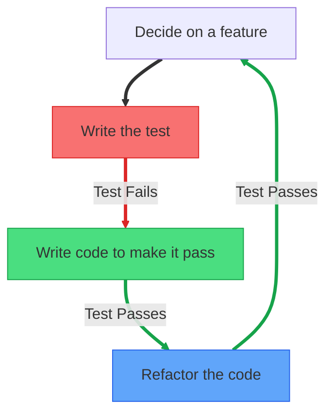
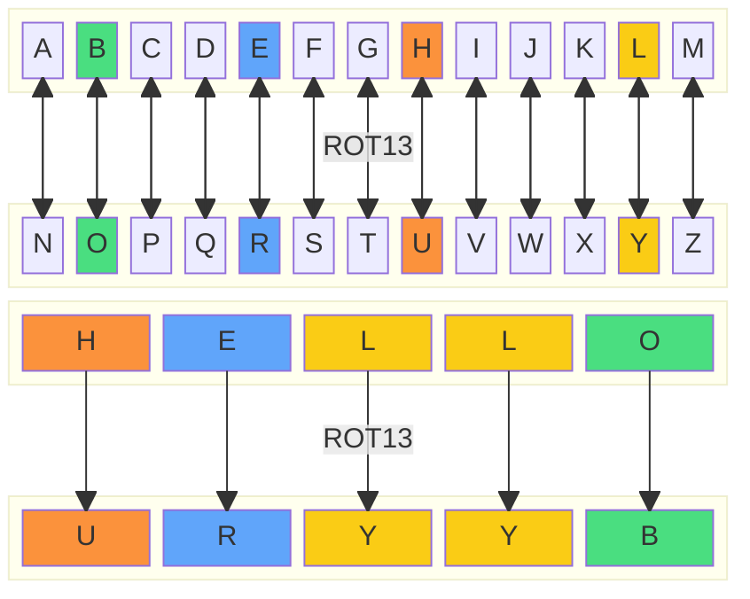

In previous discussions, we explored the concept of **Test-Driven Development (TDD)**. Despite being a valuable modern development strategy, TDD can initially feel counterintuitive to many developers.

To clarify how TDD works in practice, let's walk through a comprehensive example that will highlight its nuances and help you become comfortable applying this technique in your own projects.

We'll implement a [ROT13 cipher algorithm](https://en.wikipedia.org/wiki/ROT13)--a straightforward yet instructive example inspired by [James Shore's TDD demonstration](https://www.jamesshore.com/v2/projects/lunch-and-learn/incremental-tdd).

But first, let's briefly review the core principles of TDD and its workflow.

## TDD Principles

TDD is a software development approach that emphasizes writing tests before writing the code that needs to be tested. The primary goal of TDD is to ensure that the code meets its requirements and behaves as expected.



The TDD cycle consists of three key steps:

- ❌ **Test Fails:** Start by writing *one* test that defines the behavior of the next feature you plan to implement. Since the feature does not yet exist, the test will fail, producing a "red" error message.
- ✅ **Test Passes:** Write the minimum amount of code required to make the test pass. At this stage, focus solely on functionality, not on code design or optimization.
- 🔄 **Refactor:** Once the test passes, improve the code's structure and readability without changing its behavior. The test should continue to pass after refactoring. If it fails, the refactoring introduced an issue that needs to be addressed.

### Design Through Testing

One of the major benefits of TDD is that writing tests first forces you to think about your code's interface and behavior before implementation. The "red" phase in the red-green-refactor cycle serves as an important design exercise.

By implementing a test for code that doesn't yet exist, you must make crucial decisions about:

- How the code will be invoked
- What behaviors it will exhibit
- How it will communicate results

This process makes you approach your code from the user's perspective (the test being the first user). The result is often code with clearer, simpler interfaces that's easier to use and understand.

### Working in Small Increments

Successfully employing TDD requires working in very small, focused increments--a practice we'll emphasize in our example below.

The TDD workflow involves:

1. Implementing a single, narrowly-scoped test
2. Writing just enough code to make that test pass
3. Repeating until the entire feature is complete

This often means breaking down seemingly simple problems into even smaller steps.

### One Test at a Time

Importantly, TDD does not require implementing all tests upfront--in fact, this is considered an anti-pattern. Instead, with proper TDD, you focus on just one test at a time, gradually building functionality through this iterative process.

## The ROT13 Cipher

The ROT13 cipher is a simple letter substitution cipher that replaces a letter with the letter 13 places down the alphabet. For example, 'A' becomes 'N', 'B' becomes 'O', and so on. The ROT13 cipher is its own inverse, meaning that applying it twice returns the original text.


{/* TODO: consider a block diagram to reduce spacing between boxes and add an example with the word hello */}

For our implementation, we'll follow these specific rules:

- **Uppercase letters**: Will rotate to other uppercase letters (A → N, B → O, etc.)
- **Lowercase letters**: Will rotate to other lowercase letters (a → n, b → o, etc.)
- **Non-alphabetic characters**: Numbers, punctuation, and special characters will remain unchanged

This approach ensures the cipher maintains the original text's capitalization pattern and only transforms alphabetic characters, preserving all other elements of the input text exactly as they appear.

## First TDD Cycle

One of the primary benefits of writing tests first is that it forces you to think about your code's interface and behavior before implementation. When writing your first test, you need to decide how you'll call your code and what behavior you expect.

For our ROT13 cipher, we'll first determine the overall structure. Since we're implementing a single transformation function, creating a full class would be overkill. Instead, we'll create a module that exports a `rot13()` function.

### Red

When starting with TDD, it's crucial to begin with the most fundamental behavior. Rather than immediately testing letter transformation, we'll start even simpler: verifying that our function returns an empty string when given an empty string as input. This establishes our basic interface.

Here's our first test:

```js
// rot13.test.js
import { test, expect } from "vitest";
import { rot13 } from "./rot13.js";

test("returns empty string for empty input", () => {
  const result = rot13("");
  expect(result).toBe("");
});
```

Before running this test, we should predict the outcome. Our hypothesis: "The test will fail because our `rot13` module doesn't exist yet."

### Green

In this phase, our goal is to write just enough code to make our test pass. We don't need to worry about elegance or optimization yet--that comes during refactoring.

To satisfy our test, we'll create the basic interface and hardcode the return value:

```js
// rot13.js
export function rot13() {
  return "";
}
```

Notice how small this step is--we've only established the most basic interface, without even adding parameters. This demonstrates the incremental nature of TDD.

While these tiny steps might seem too cautious, they allow us to move quickly and confidently. This first cycle likely took less than a minute, yet we already have a meaningful test and the foundation of our implementation.

### Refactor

The final phase gives us an opportunity to improve our code without changing its behavior. We can enhance readability, optimize performance, or rename tests for clarity.

In this simple first cycle, there's not much refactoring needed. Our implementation is minimal, and our test is straightforward.

## Second TDD Cycle

For our second TDD cycle, we'll tackle a small piece of our ROT13 function's core logic. When applying TDD, the key is to work in extremely small, manageable steps.

### Red

While we know our final implementation will need to loop through each character in the input string, that would be too large a step for a single TDD cycle. Even handling "any single character" would be overly ambitious at this stage.

Instead, let's focus on a highly specific case: transforming a single lowercase letter forward by 13 positions without handling alphabet wrap-around. For this test cycle, we'll verify that 'a' transforms to 'n'.

```js
// rot13.test.js
test("transforms one lowercase letter without wrapping", () => {
  const result = rot13("a");
  expect(result).toBe("n");
});
```
Before running this test, our hypothesis is: "This test will fail because our current implementation always returns an empty string regardless of input."

### Green

To make our test pass, we need to:

1. Modify our function to accept input parameters
2. Preserve our existing functionality (returning empty string for empty input)
3. Add the transformation logic for our specific test case

```js
// rot13.js
export function rot13(input) {
  if (input === "") {
    return "";
  }

  const charCode = input.codePointAt(0);
  return String.fromCodePoint(charCode + 13);
}
```

This implementation uses two built-in [JavaScript String](https://developer.mozilla.org/en-US/docs/Web/JavaScript/Reference/Global_Objects/String) methods:

- [`codePointAt(index)`](https://developer.mozilla.org/en-US/docs/Web/JavaScript/Reference/Global_Objects/String/codePointAt) converts a character to its Unicode code point (e.g., "a" → 97)
- [`String.fromCodePoint()`](https://developer.mozilla.org/en-US/docs/Web/JavaScript/Reference/Global_Objects/String/fromCodePoint) generates a character from a code point (e.g., 110 → "n")

Our solution simply adds 13 to the character code of the first letter. We've written just enough code to make our specific test pass--no more, no less.

### Refactor

At this stage, our implementation is straightforward and clean. There's little need for refactoring, so we can proceed to the next TDD cycle, where we'll incrementally add more functionality.

## Expanding TDD Cycles for Single Letters

Let's continue our TDD process by adding more functionality to handle single letter inputs completely.

### Handling Looping for Lowercase Letters

Our next step is to handle transforming letters that need to loop around the alphabet. Let's test the scenario where 'n' should transform to 'a':

```js
// rot13.test.js
test("transforms one lowercase letter with wrapping", () => {
  const result = rot13("n");
  expect(result).toBe("a");
});
```

To implement this correctly, we need to determine if a letter is in the first half of the alphabet (where we add 13) or the second half (where we subtract 13 to achieve the same effect as looping):

```js
// rot13.js
export function rot13(input) {
  if (input === "") {
    return "";
  }

  const charCode = input.codePointAt(0);

  if (isBetween(charCode, "a", "m")) {
    return String.fromCodePoint(charCode + 13);
  } else if (isBetween(charCode, "n", "z")) {
    return String.fromCodePoint(charCode - 13);
  }
}

function isBetween(charCode, firstLetter, lastLetter) {
  return (
    charCode >= charCodeFor(firstLetter) && charCode <= charCodeFor(lastLetter)
  );
}

function charCodeFor(letter) {
  return letter.codePointAt(0);
}
```

These utility functions make our code more readable and easier to maintain:

- `isBetween()` checks if a character code falls within a specified range
- `charCodeFor()` provides a cleaner way to access character codes

### Handling Uppercase Letters Without Looping

Now let's address uppercase letters. Following our incremental approach, we'll first handle uppercase letters without looping:

```js
// rot13.test.js
test("transforms one uppercase letter without wrapping", () => {
  expect(rot13("A")).toBe("N");
});
```

To make this test pass, we expand our condition to check for both lowercase and uppercase letters in the first half of the alphabet:

```diff lang="js"
// rot13.js
-if (isBetween(charCode, "a", "m")) {}
+if (isBetween(charCode, "a", "m") || isBetween(charCode, "A", "M")) {
  return String.fromCodePoint(charCode + 13);
} else if (isBetween(charCode, "n", "z")) {
  return String.fromCodePoint(charCode - 13);
}
```

### Handling Looping for Uppercase Letters

Finally, let's handle uppercase letters that require looping:

```js
// rot13.test.js
test("transforms one uppercase letter with wrapping", () => {
  expect(rot13("N")).toBe("A");
});
```

Similar to our previous modification, we expand the second condition to check for uppercase letters in the latter half of the alphabet:

```diff lang="js"
// rot13.js
if (isBetween(charCode, "a", "m") || isBetween(charCode, "A", "M")) {
  return String.fromCodePoint(charCode + 13);
-} else if (isBetween(charCode, "n", "z")) {
+} else if (isBetween(charCode, "n", "z") || isBetween(charCode, "N", "Z")) {
  return String.fromCodePoint(charCode - 13);
}
```

Our implementation now correctly handles all single letter transformations, both uppercase and lowercase, with proper alphabet wrapping. Each small, focused TDD cycle has incrementally built our functionality while maintaining test coverage.

### Handling Boundary Cases: Non-Alphabetic Characters

Let's continue our TDD process by implementing tests for non-alphabetic characters that should remain unchanged.

Rather than testing every possible non-alphabetic character, we'll focus on boundary cases - specifically the characters immediately before and after our alphabet ranges:

```js
// Finding boundary characters using character codes
String.fromCodePoint("a".codePointAt(0) - 1)  // "`"
String.fromCodePoint("z".codePointAt(0) + 1)  // "{"
String.fromCodePoint("A".codePointAt(0) - 1)  // "@"
String.fromCodePoint("Z".codePointAt(0) + 1)  // "["
```

Let's implement our first test for the character before `'a'`:

```js
// rot13.test.js
test("doesn't transform '`' (first char before 'a')", () => {
  expect(rot13("`")).toBe("`");
});
```

To make this test pass, we need to add an `else` clause to return non-letter characters unchanged:

```diff lang="js"
// rot13.js
if (isBetween(charCode, "a", "m") || isBetween(charCode, "A", "M")) {
  return String.fromCodePoint(charCode + 13);
} else if (isBetween(charCode, "n", "z")) {
} else if (isBetween(charCode, "n", "z") || isBetween(charCode, "N", "Z")) {
  return String.fromCodePoint(charCode - 13);
-}
+} else {
+  return String.fromCodePoint(charCode);
+}
```

Now we can add tests for the other boundary cases:


```js
// rot13.test.js
test("doesn't transform '{' (first char after 'z')", () => {
  expect(rot13("{")).toBe("{");
});

test("doesn't transform '@' (first char before 'A')", () => {
  expect(rot13("@")).toBe("@");
});

test("doesn't transform '[' (first char after 'Z')", () => {
  expect(rot13("[")).toBe("[");
});
```

These additional tests should pass without any further code changes.

### Final Refactoring for Single Letters

Now that we've completely implemented the single-letter transformation behavior, let's refactor our code with an eye toward future enhancements. Specifically, we'll extract the character transformation logic into its own function to make it reusable when we implement multi-character string support:

```js
// rot13.js
export function rot13(input) {
  if (input === "") {
    return "";
  }

  const charCode = input.codePointAt(0);
  return transformChar(charCode);
}

function transformChar(charCode) {
  if (isBetween(charCode, "a", "m") || isBetween(charCode, "A", "M")) {
    return String.fromCodePoint(charCode + 13);
  } else if (isBetween(charCode, "n", "z") || isBetween(charCode, "N", "Z")) {
    return String.fromCodePoint(charCode - 13);
  } else {
    return String.fromCodePoint(charCode);
  }
}

function isBetween(charCode, firstLetter, lastLetter) {
  const firstCharCode = charCodeFor(firstLetter);
  const lastCharCode = charCodeFor(lastLetter);

  return charCode >= firstCharCode && charCode <= lastCharCode;
}

function charCodeFor(letter) {
  return letter.codePointAt(0);
}
```

After making these changes, we should run all our tests to verify that our refactoring hasn't broken any functionality.

## Handling Multi-Character Strings with TDD

Let's continue our TDD journey by adding support for multi-character strings. We'll go through the complete TDD cycle for this enhancement.

### Red

Our `rot13()` function should process each character in a multi-character string the same way it handles individual characters. Let's create a test that verifies this behavior:

```js
// rot13.test.js
test("transforms a multi-character string", () => {
  expect(rot13("abc")).toBe("nop");
});
```

Before running this test, let's form a hypothesis: "Our current implementation only transforms the first character of any input string. So for the input "abc", we expect it to transform 'a' to 'n', but ignore 'b' and 'c'." Running the test confirms this limitation.

### Green

To handle multi-character strings, we need to process each character in the input and build the transformed result:

```js
// rot13.js
export function rot13(input) {
  if (input === "") {
    return "";
  }
  
  let result = "";
  for (let i = 0; i < input.length; i++) {
    const charCode = input.codePointAt(i);
    result += transformChar(charCode);
  }
  return result;
}
```

This implementation loops through each character in the input string, transforms it using our previously defined `transformChar()` function, and concatenates the results. Running the tests now shows they all pass.

### Refactor

Now that we support multi-character strings, we can refactor our tests to be more comprehensive:

```js
// rot13.test.js
test("transforms all lowercase letters", () => {
  expect(rot13("abcdefghijklmnopqrstuvwxyz")).toBe(
    "nopqrstuvwxyzabcdefghijklm"
  );
});

test("transforms all uppercase letters", () => {
  expect(rot13("ABCDEFGHIJKLMNOPQRSTUVWXYZ")).toBe(
    "NOPQRSTUVWXYZABCDEFGHIJKLM"
  );
});

test("doesn't transform multiple symbols", () => {
  expect(rot13("`{@[")).toBe("`{@[");
});
```

These new tests provide complete coverage:

- The first test verifies all lowercase letters transform correctly
- The second test confirms all uppercase letters transform properly
- The third test ensures multiple non-alphabetic characters remain unchanged

While our existing single-character tests might seem redundant now, they're valuable for debugging and regression testing. If we change our implementation in the future, these granular tests will help pinpoint exactly where issues occur, so we'll keep them.

With these changes, our ROT13 implementation is now complete and thoroughly tested.

## Final TDD Cycles: Error Handling and Edge Cases

Let's complete our TDD process by adding error handling and support for special input cases like emojis.

During the "red" phase of TDD, we make design decisions about our code's interface--including how errors should be handled. For our ROT13 implementation, we'll design the function to throw an Error when it receives invalid input.

### Missing Parameters

Let's start by handling the case when no parameter is passed to our function:

```js
// rot13.test.js
test("throws an error when no parameter is passed", () => {
  expect(() => {
    rot13();
  }).toThrowError("Expected string parameter");
});
```

Remember that [`toThrowError()`](https://vitest.dev/api/expect.html#tothrowerror) expects a function as its first argument.

To make this test pass, we add a simple parameter check at the beginning of our function:

```js
// rot13.js
export function rot13(input) {
  if (input === undefined) {
    throw new Error("Expected string parameter");
  }
  // ...
}
```

### Non-String Parameter

Now let's handle the case when a non-string value is passed:

```js
// rot13.test.js
test("throws an error when non-string is passed", () => {
  expect(() => {
    rot13(123);
  }).toThrowError("Expected string parameter");
});
```

We can extend our parameter validation to check for the correct type:

```js
// rot13.js
export function rot13(input) {
  if (input === undefined || typeof input !== "string") {
    throw new Error("Expected string parameter");
  }
  // ...
}
```

### Other Special Cases

Finally, let's add tests for various special input cases to ensure our ROT13 function handles them correctly:

```js
// rot13.test.js
test("doesn't transform numbers", () => {
  expect(rot13("0123456789")).toBe("0123456789");
});

test("doesn't transform non-English letters", () => {
  expect(rot13("ñåéîøüç")).toBe("ñåéîøüç");
});

test("handles emojis correctly", () => {
  expect(rot13("🤓🤩")).toBe("🤓🤩");
});
```

Interestingly, the emojis are not handled properly by our current implementation. The `codePointAt()` method returns the code point of the first character, but emojis can be represented by multiple code points. 

There are multiple ways to handle this, but the easiest solution is to change our `for` loop by a `for...of` loop, which correctly iterates over Unicode characters. This ensures proper handling of surrogate pairs so characters like emojis are treated as single units.

```diff lang="js"
// rot13.js
export function rot13(input) {
  if (input === undefined || typeof input !== "string") {
    throw new Error("Expected string parameter");
  }

  if (input === "") {
    return "";
  }

  let result = "";
-  for (let i = 0; i < input.length; i++) {   
+  for (let char of input) {
-    const charCode = input.codePointAt(i);
+    const charCode = charCodeFor(char);
    result += transformChar(charCode);
  }
  return result;
}
```

The other tests should pass without any changes. We're free to refactor further if we want, but our implementation is already clean and efficient.

## Additional Resources

- [Incremental Test-Driven Development](https://www.jamesshore.com/v2/projects/lunch-and-learn/incremental-tdd) by James Shore
- [When I Follow TDD](https://kentcdodds.com/blog/when-i-follow-tdd) by Kent C. Dodds
- [Other Driven Development](https://shopify.engineering/other-driven-developments) by Shopify Engineering

## Summary

While TDD adoption varies widely across companies, teams, and individual developers, many successful tech companies incorporate TDD practices, including:

- Extreme Programming (XP) practitioners
- Companies building mission-critical software where reliability is paramount
- Teams maintaining large codebases over long periods
- Some open-source projects with strong testing cultures

That said, TDD isn't universally practiced, even among those who value testing. Many developers:

- Write tests after implementation rather than before
- Use a hybrid approach based on the feature complexity
- Apply TDD selectively for critical or complex components
- Find TDD too rigid for early-stage prototyping or UI development

The reality is that TDD exists on a spectrum in the industry. Some developers swear by strict TDD for everything, while others appreciate its principles but apply them flexibly. [Kent Beck](https://en.wikipedia.org/wiki/Kent_Beck) (who popularized XP and TDD) himself has noted that the goal is working, reliable software--not dogmatic adherence to any particular methodology.

For many teams, the core ideas of TDD--thinking through requirements before implementation, creating automated verification, and refactoring with confidence--provide value even when not followed to the letter.
